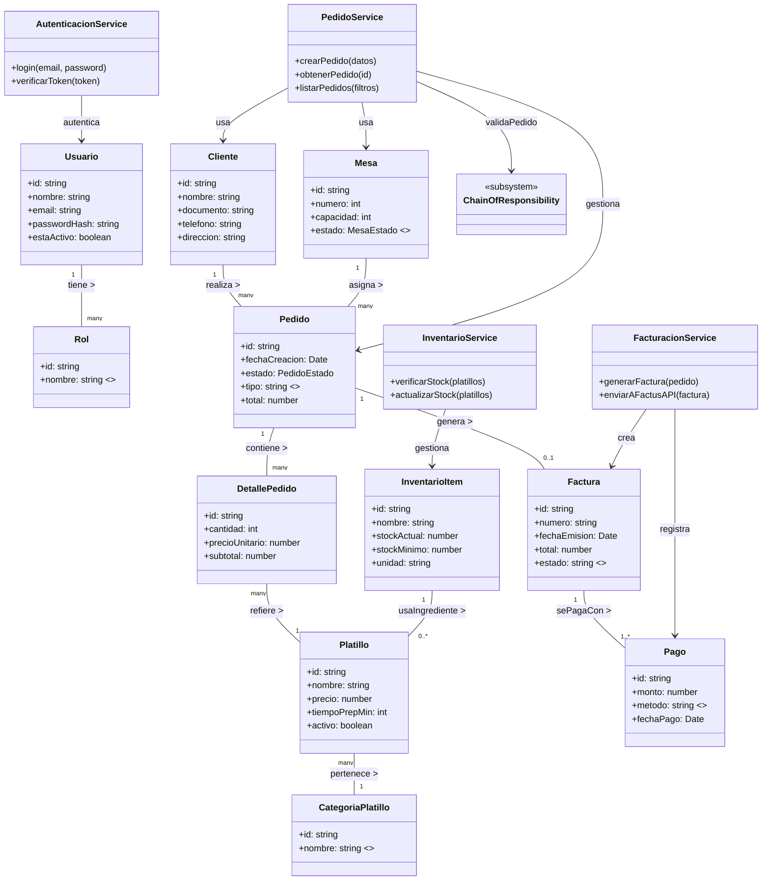
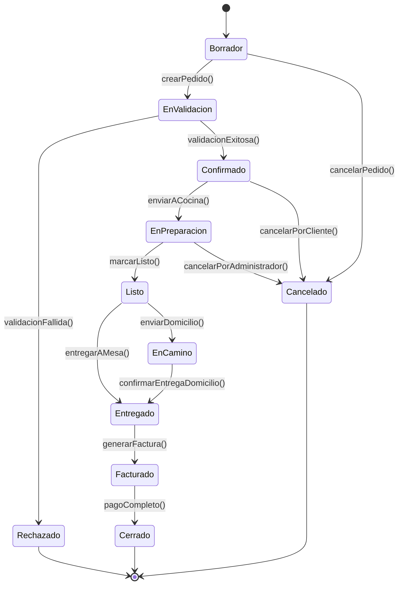
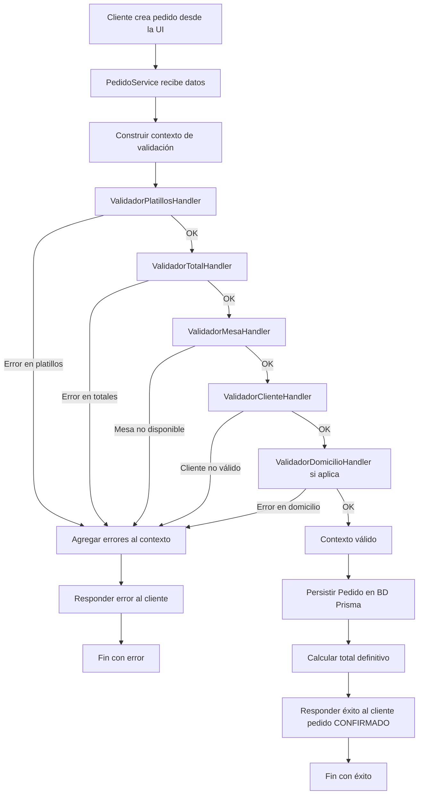
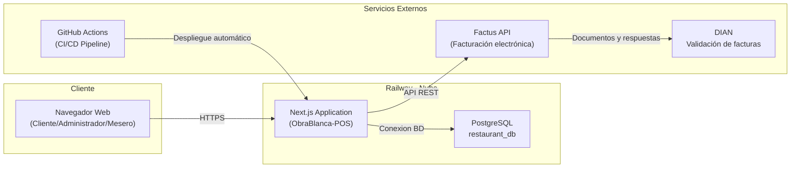
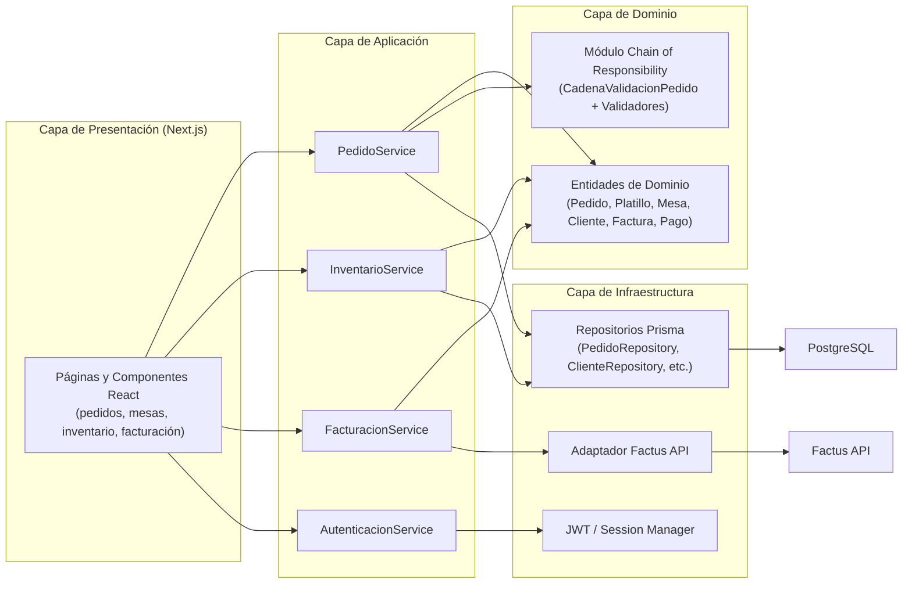
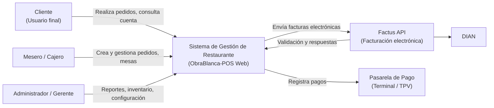

# Diagramas del Sistema

## 1. Diagrama de Clases Global del Sistema

## 2. Diagrama de Estados – Pedido

## 3. Diagrama de Comportamiento – Flujo de Creación y Validación de Pedido

## 4. Diagrama de Despliegue – Arquitectura en Railway

## 5. Diagrama de Componentes

## 6. Diagrama de Contexto (C4 Nivel 1)

