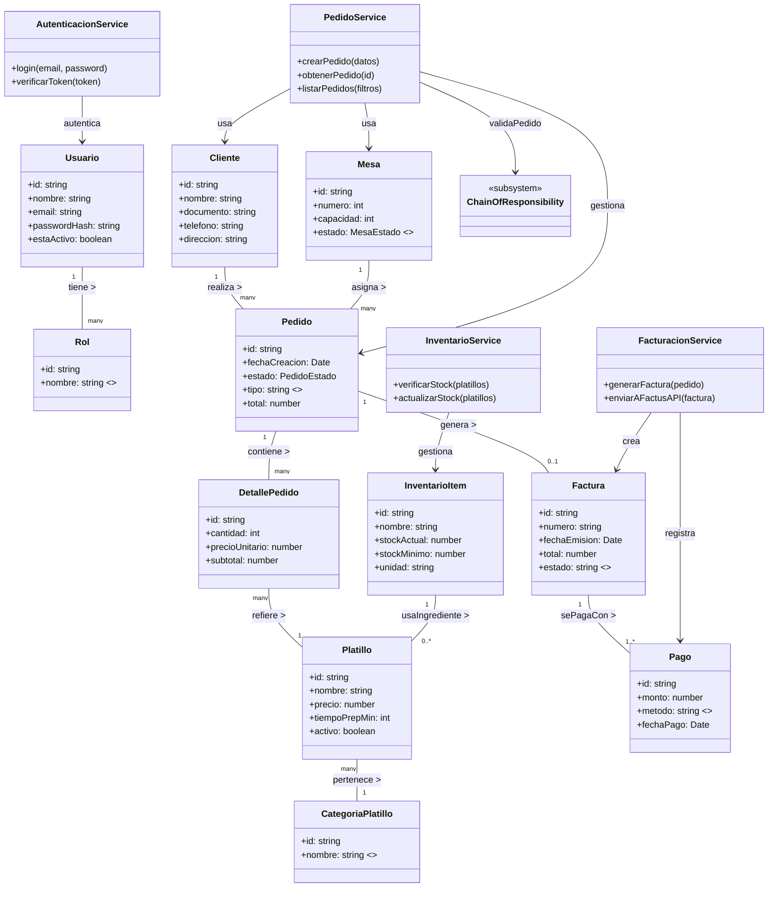
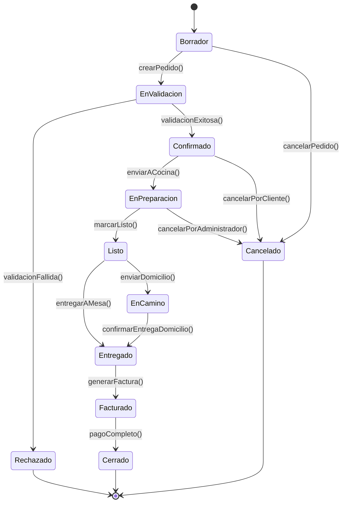
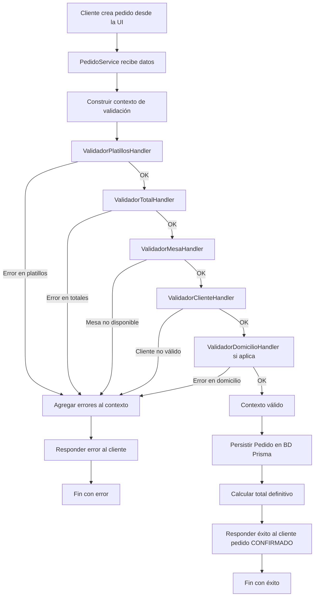
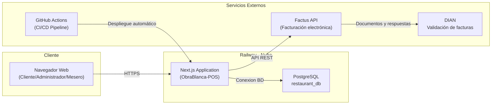
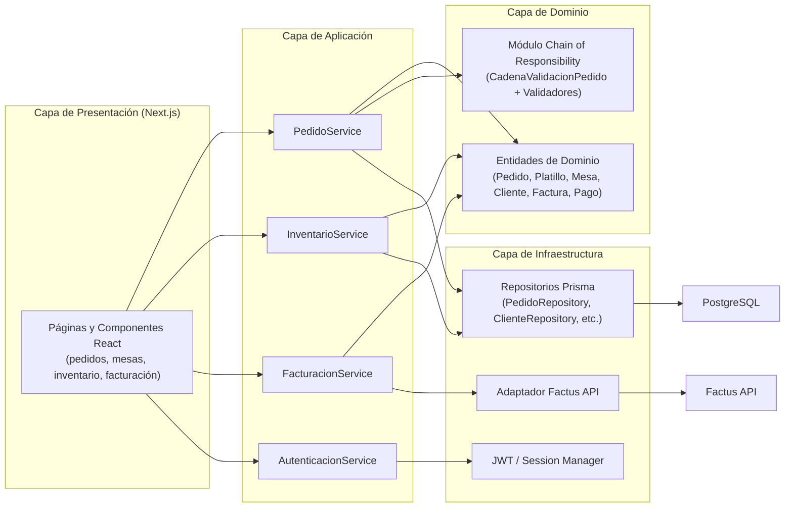
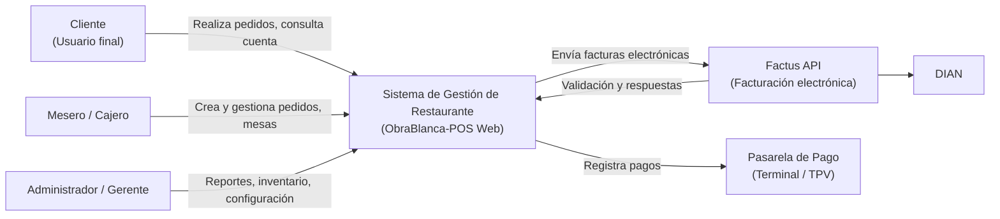
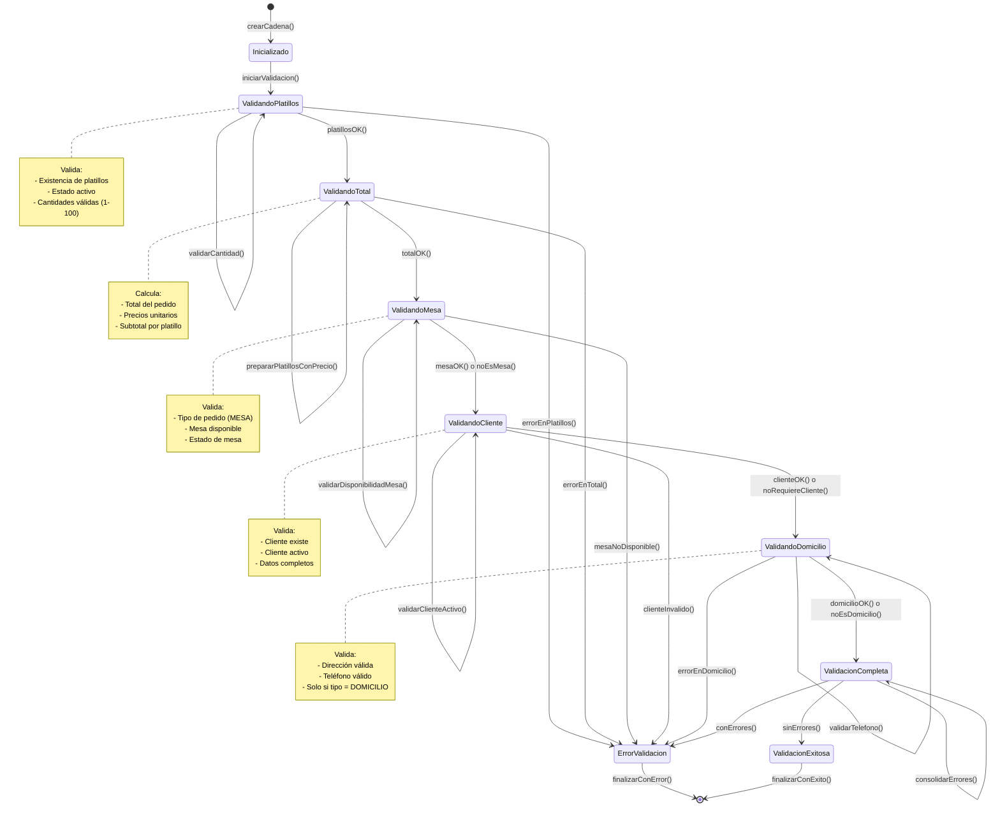
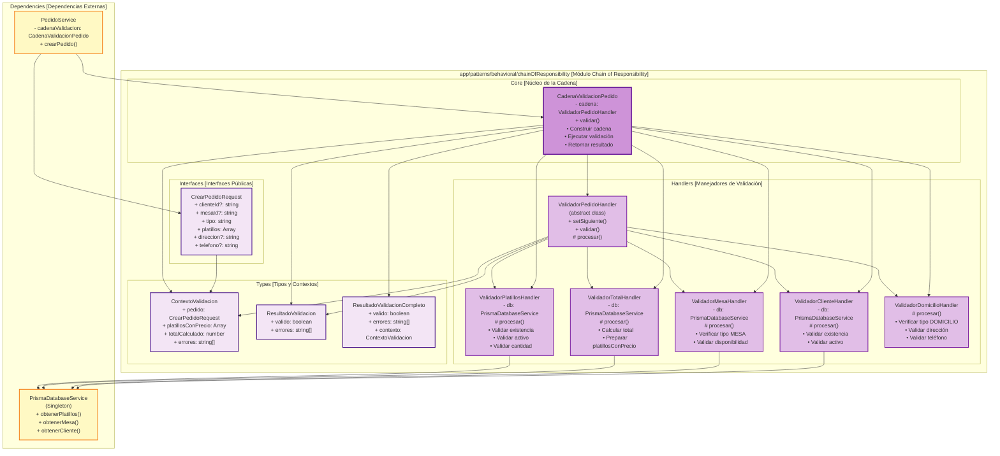

# Diagramas del Sistema

## 1. Diagrama de Clases Global del Sistema

## 2. Diagrama de Estados – Pedido

## 3. Diagrama de Comportamiento – Flujo de Creación y Validación de Pedido

## 4. Diagrama de Despliegue – Arquitectura en Railway

## 5. Diagrama de Componentes

## 6. Diagrama de Contexto (C4 Nivel 1)

## 7. Diagrama de Estados – Chain of Responsibility (Validación de Pedidos)

## 8. Diagrama de Paquetes – Estructura de Módulos del Sistema

```mermaid
graph TB
    subgraph "restaurant [Sistema Principal]"
        subgraph "app [Aplicación Next.js]"
            subgraph "app/api [API Routes]"
                API_Pedidos["api/pedidos<br/>- POST /crear<br/>- GET /listar<br/>- GET /:id"]
                API_Clientes["api/clientes<br/>- GET /listar<br/>- POST /crear"]
                API_Mesas["api/mesas<br/>- GET /estado<br/>- PUT /actualizar"]
                API_Facturacion["api/facturacion<br/>- POST /generar<br/>- GET /pdf/:id"]
            end
            
            subgraph "app/patterns [Patrones de Diseño]"
                subgraph "app/patterns/behavioral [Patrones de Comportamiento]"
                    subgraph "app/patterns/behavioral/chainOfResponsibility [Chain of Responsibility]"
                        COR_Handler["ValidadorPedidoHandler<br/>(clase abstracta)"]
                        COR_Platillos["ValidadorPlatillosHandler"]
                        COR_Total["ValidadorTotalHandler"]
                        COR_Mesa["ValidadorMesaHandler"]
                        COR_Cliente["ValidadorClienteHandler"]
                        COR_Domicilio["ValidadorDomicilioHandler"]
                        COR_Cadena["CadenaValidacionPedido"]
                        COR_Types["ContextoValidacion<br/>ResultadoValidacion"]
                    end
                end
                
                subgraph "app/patterns/creational [Patrones Creacionales]"
                    CREA_Singleton["singleton/"]
                    CREA_Factory["factory/"]
                    CREA_Builder["builder/"]
                    CREA_Prototype["prototype/"]
                end
                
                subgraph "app/patterns/structural [Patrones Estructurales]"
                    STRU_Decorator["decorator/"]
                    STRU_Adapter["adapter/"]
                    STRU_Bridge["bridge/"]
                    STRU_Proxy["proxy/"]
                end
            end
            
            subgraph "app/services [Servicios de Negocio]"
                SVC_Pedido["PedidoService<br/>- crearPedido()<br/>- obtenerPedido()<br/>- listarPedidos()"]
                SVC_Inventario["InventarioService<br/>- verificarStock()<br/>- actualizarStock()"]
                SVC_Facturacion["FacturacionService<br/>- generarFactura()<br/>- enviarAFactusAPI()"]
                SVC_Auth["AutenticacionService<br/>- login()<br/>- verificarToken()"]
            end
            
            subgraph "app/types [Tipos y Entidades]"
                TYPES_Entidades["Entidades de Dominio<br/>- Pedido<br/>- Cliente<br/>- Mesa<br/>- Platillo<br/>- Factura<br/>- Pago"]
                TYPES_Requests["Tipos de Request<br/>- CrearPedidoRequest<br/>- FactusInvoiceRequest"]
            end
        end
        
        subgraph "prisma [ORM y Base de Datos]"
            PRISMA_Schema["schema.prisma<br/>- Modelos de datos<br/>- Relaciones<br/>- Migrations"]
            PRISMA_Client["Prisma Client<br/>- Queries<br/>- Transactions"]
        end
        
        subgraph "lib [Bibliotecas y Utilidades]"
            LIB_Utils["utils/<br/>- Helpers<br/>- Formatters"]
            LIB_Constants["constants/<br/>- Configuración<br/>- Enums"]
        end
        
        subgraph "scripts [Scripts de Utilidad]"
            SCRIPTS_Migrate["migrate-data.ts"]
            SCRIPTS_Seed["insert-sample-data.ts"]
            SCRIPTS_Setup["setup-db.js"]
        end
    end
    
    subgraph "External [Servicios Externos]"
        EXT_Factus["Factus API<br/>- OAuth2<br/>- Invoice Management"]
        EXT_DIAN["DIAN<br/>- Validación Fiscal"]
    end
    
    %% Relaciones API Routes
    API_Pedidos --> SVC_Pedido
    API_Clientes --> SVC_Pedido
    API_Mesas --> SVC_Pedido
    API_Facturacion --> SVC_Facturacion
    
    %% Relaciones Servicios con Chain of Responsibility
    SVC_Pedido --> COR_Cadena
    COR_Cadena --> COR_Handler
    COR_Handler --> COR_Platillos
    COR_Handler --> COR_Total
    COR_Handler --> COR_Mesa
    COR_Handler --> COR_Cliente
    COR_Handler --> COR_Domicilio
    COR_Cadena --> COR_Types
    
    %% Relaciones Servicios con Base de Datos
    SVC_Pedido --> PRISMA_Client
    SVC_Inventario --> PRISMA_Client
    SVC_Facturacion --> PRISMA_Client
    SVC_Auth --> PRISMA_Client
    
    %% Relaciones Chain of Responsibility con Base de Datos
    COR_Platillos --> PRISMA_Client
    COR_Total --> PRISMA_Client
    COR_Mesa --> PRISMA_Client
    COR_Cliente --> PRISMA_Client
    
    %% Relaciones Servicios con Tipos
    SVC_Pedido --> TYPES_Entidades
    SVC_Pedido --> TYPES_Requests
    COR_Cadena --> TYPES_Requests
    
    %% Relaciones Facturación con Externos
    SVC_Facturacion --> EXT_Factus
    EXT_Factus --> EXT_DIAN
    
    %% Relaciones Scripts
    SCRIPTS_Migrate --> PRISMA_Client
    SCRIPTS_Seed --> PRISMA_Client
    SCRIPTS_Setup --> PRISMA_Client
    
    %% Estilos
    classDef api fill:#e3f2fd,stroke:#1976d2,stroke-width:2px
    classDef cor fill:#f3e5f5,stroke:#7b1fa2,stroke-width:3px
    classDef service fill:#e8f5e9,stroke:#388e3c,stroke-width:2px
    classDef database fill:#fff3e0,stroke:#f57c00,stroke-width:2px
    classDef external fill:#ffebee,stroke:#c62828,stroke-width:2px
    classDef types fill:#f1f8e9,stroke:#558b2f,stroke-width:2px
    
    class API_Pedidos,API_Clientes,API_Mesas,API_Facturacion api
    class COR_Handler,COR_Platillos,COR_Total,COR_Mesa,COR_Cliente,COR_Domicilio,COR_Cadena,COR_Types cor
    class SVC_Pedido,SVC_Inventario,SVC_Facturacion,SVC_Auth service
    class PRISMA_Schema,PRISMA_Client database
    class EXT_Factus,EXT_DIAN external
    class TYPES_Entidades,TYPES_Requests types
```

## 9. Diagrama de Paquetes Detallado – Chain of Responsibility

