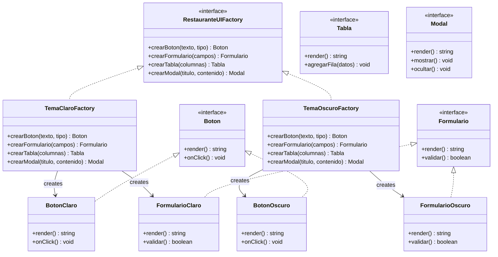
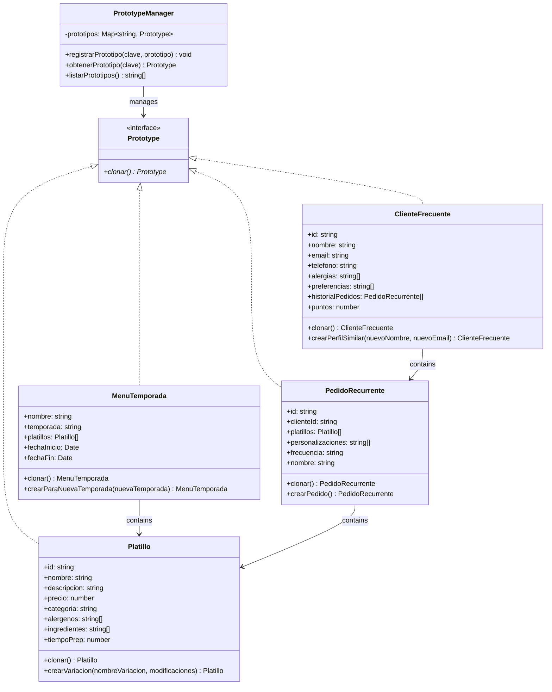
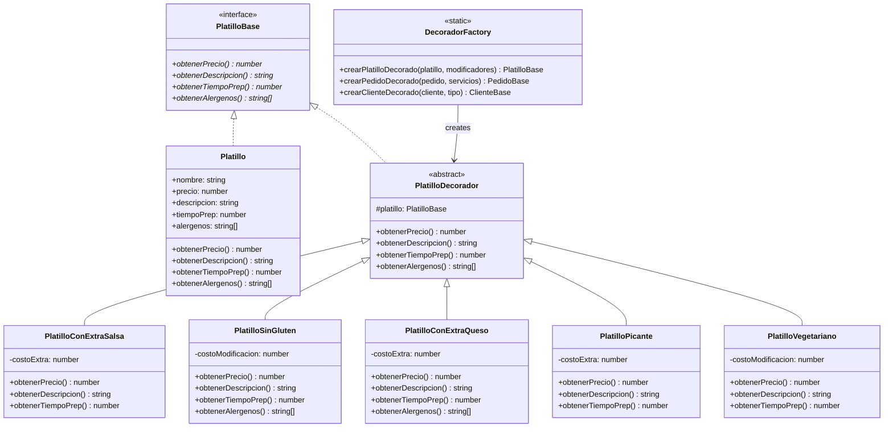
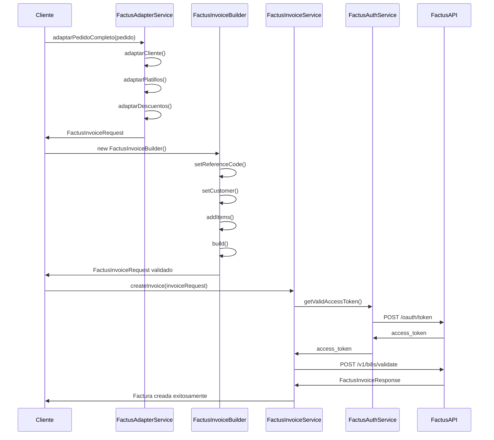

# Documentación Completa de Patrones de Diseño - Sistema de Gestión de Restaurante

## Tabla de Contenidos

1. [Patrones Creacionales](#patrones-creacionales)
   - [Singleton](#singleton)
   - [Factory Method](#factory-method)
   - [Abstract Factory](#abstract-factory)
   - [Prototype](#prototype)
   - [Builder](#builder)
2. [Patrones Estructurales](#patrones-estructurales)
   - [Decorator](#decorator)
   - [Adapter](#adapter)
   - [Bridge](#bridge)
   - [Proxy](#proxy)
3. [Facturación Electrónica](#facturación-electrónica)
   - [Integración con Factus API](#integración-con-factus-api)
   - [Patrones Aplicados](#patrones-aplicados)

---


## Patrones Creacionales

### Singleton

**Propósito**: Garantizar que una clase tenga solo una instancia y proporcionar un punto de acceso global a ella.

**Implementación**: Se implementaron 3 singletons para diferentes responsabilidades del sistema:

#### 1. DatabaseConnection
```typescript
export class DatabaseConnection implements DatabaseConnectionInterface {
    private static instance: DatabaseConnection
    private connected: boolean = false
    
    private constructor() {
        console.log('🔗 DatabaseConnection: Instancia creada')
    }
    
    public static getInstance(): DatabaseConnection {
        if (!DatabaseConnection.instance) {
            DatabaseConnection.instance = new DatabaseConnection()
        }
        return DatabaseConnection.instance
    }
}
```

#### 2. ConfigurationManager
```typescript
export class ConfigurationManager {
    private static instance: ConfigurationManager
    private config: Map<string, any> = new Map()
    
    public static getInstance(): ConfigurationManager {
        if (!ConfigurationManager.instance) {
            ConfigurationManager.instance = new ConfigurationManager()
        }
        return ConfigurationManager.instance
    }
}
```

#### 3. NotificationService
```typescript
export class NotificationService {
    private static instance: NotificationService
    private notifications: Array<{...}> = []
    
    public static getInstance(): NotificationService {
        if (!NotificationService.instance) {
            NotificationService.instance = new NotificationService()
        }
        return NotificationService.instance
    }
}
```

**Ventajas**:
- Control de acceso a recursos compartidos
- Evita múltiples conexiones a base de datos
- Configuración centralizada del sistema
- Servicio de notificaciones unificado

**Uso en el Sistema**:
- Conexión única a base de datos
- Configuración global del restaurante (IVA, moneda, etc.)
- Centro de notificaciones para todo el sistema

---

### Factory Method

**Propósito**: Crear objetos sin especificar sus clases concretas, delegando la creación a subclases.

**Implementación**: Se implementaron factories para crear diferentes tipos de platillos y pedidos:

#### Diagrama de Clases - Factory Method


**Código Principal**:
```typescript
export abstract class PlatilloFactory {
    abstract crearPlatillo(): Platillo
    
    public procesarPlatillo(): Platillo {
        const platillo = this.crearPlatillo()
        console.log(`Creando ${platillo.categoria}: ${platillo.nombre}`)
        return platillo
    }
}

export class EntradaFactory extends PlatilloFactory {
    crearPlatillo(): Platillo {
        return new Entrada()
    }
}
```

**Ventajas**:
- Extensibilidad para nuevos tipos de platillos
- Separación de la lógica de creación
- Cumple con el principio Open/Closed

**Uso en el Sistema**:
- Creación de diferentes tipos de platillos según categoría
- Creación de pedidos según tipo (mesa, para llevar, domicilio)

---

### Abstract Factory

**Propósito**: Crear familias de objetos relacionados sin especificar sus clases concretas.

**Implementación**: Se implementó para crear componentes UI coherentes y diferentes tipos de reportes:

#### Diagrama de Clases - Abstract Factory



**Código Principal**:
```typescript
export interface RestauranteUIFactory {
    crearBoton(texto: string, tipo: 'primary' | 'secondary' | 'danger'): Boton
    crearFormulario(campos: string[]): Formulario
    crearTabla(columnas: string[]): Tabla
    crearModal(titulo: string, contenido: string): Modal
}

export class TemaClaroFactory implements RestauranteUIFactory {
    crearBoton(texto: string, tipo: 'primary' | 'secondary' | 'danger'): Boton {
        return new BotonClaro(texto, tipo)
    }
    // ... otros métodos
}
```

**Ventajas**:
- Consistencia visual en toda la aplicación
- Fácil cambio de tema (claro/oscuro)
- Extensibilidad para nuevos temas

**Uso en el Sistema**:
- Creación de componentes UI coherentes
- Generación de reportes en diferentes formatos (PDF, Excel, JSON)

---

### Prototype

**Propósito**: Crear objetos clonando una instancia existente en lugar de crear nuevos desde cero.

**Implementación**: Se implementó para clonar platillos, menús de temporada y clientes frecuentes:

#### Diagrama de Clases - Prototype



**Código Principal**:
```typescript
export class Platillo implements Prototype {
    clonar(): Platillo {
        return Object.assign(Object.create(Object.getPrototypeOf(this)), {
            ...this,
            id: Math.random().toString(36).substr(2, 9),
            alergenos: [...this.alergenos],
            ingredientes: [...this.ingredientes]
        })
    }
    
    crearVariacion(nombreVariacion: string, modificaciones: Partial<Platillo>): Platillo {
        const variacion = this.clonar()
        variacion.nombre = `${this.nombre} - ${nombreVariacion}`
        Object.assign(variacion, modificaciones)
        return variacion
    }
}
```

**Ventajas**:
- Eficiencia en la creación de objetos complejos
- Facilita la creación de variaciones
- Reduce la carga de inicialización

**Uso en el Sistema**:
- Clonación de platillos para crear variaciones
- Creación de menús para nuevas temporadas
- Duplicación de pedidos recurrentes

---

### Builder

**Propósito**: Construir objetos complejos paso a paso, permitiendo diferentes representaciones.

**Implementación**: Se implementó para construir pedidos complejos, reportes y notificaciones:

#### Diagrama de Clases - Builder


**Código Principal**:
```typescript
export class PedidoBuilder {
    private pedido: Partial<PedidoCompleto> = {
        id: Math.random().toString(36).substr(2, 9),
        platillos: [],
        personalizaciones: [],
        descuentos: [],
        total: 0,
        fechaCreacion: new Date()
    }
    
    public configurarCliente(clienteId: string): PedidoBuilder {
        this.pedido.clienteId = clienteId
        return this
    }
    
    public agregarPlatillo(platilloId: string, nombre: string, precio: number, cantidad: number = 1): PedidoBuilder {
        const platilloPedido: PlatilloPedido = {
            platilloId, nombre, cantidad, precioUnitario: precio,
            personalizaciones: [], alergenos: [], tiempoPrep: 15
        }
        this.pedido.platillos!.push(platilloPedido)
        this.calcularTotal()
        return this
    }
    
    public build(): PedidoCompleto {
        if (!this.pedido.tipo) {
            throw new Error('Debe especificar el tipo de pedido')
        }
        return this.pedido as PedidoCompleto
    }
}
```

**Ventajas**:
- Construcción paso a paso de objetos complejos
- Código más legible y mantenible
- Validación durante la construcción
- Reutilización del builder

**Uso en el Sistema**:
- Construcción de pedidos complejos con múltiples platillos
- Generación de reportes con varios filtros
- Creación de notificaciones con contenido variable

---

## Patrones Estructurales

### Decorator

**Propósito**: Añadir responsabilidades a objetos dinámicamente sin alterar su estructura.

**Implementación**: Se implementó para personalizar platillos, pedidos y clientes:

#### Diagrama de Clases - Decorator



**Código Principal**:
```typescript
export abstract class PlatilloDecorador implements PlatilloBase {
    constructor(protected platillo: PlatilloBase) { }
    
    obtenerPrecio(): number {
        return this.platillo.obtenerPrecio()
    }
    // ... otros métodos base
}

export class PlatilloConExtraSalsa extends PlatilloDecorador {
    private costoExtra = 2000
    
    obtenerPrecio(): number {
        return this.platillo.obtenerPrecio() + this.costoExtra
    }
    
    obtenerDescripcion(): string {
        return this.platillo.obtenerDescripcion() + " + Extra salsa"
    }
}
```

**Ventajas**:
- Flexibilidad para añadir funcionalidades
- Composición dinámica de características
- Cumple con el principio Open/Closed

**Uso en el Sistema**:
- Personalización de platillos (extra salsa, sin gluten, etc.)
- Servicios adicionales en pedidos (envío, embalaje especial)
- Beneficios de clientes (VIP, Premium)

---

### Adapter

**Propósito**: Permitir que interfaces incompatibles trabajen juntas.

**Implementación**: Se implementó para integrar sistemas de pago externos y servicios de delivery:

#### Diagrama de Clases - Adapter


**Código Principal**:
```typescript
export class AdaptadorCripto implements SistemaPagoInterno {
    constructor(private servicioCripto: ServicioCriptoExterno) { }
    
    async procesarPago(monto: number, metodo: string): Promise<ResultadoPago> {
        try {
            const walletAddress = 'restaurant_wallet_address'
            
            let resultado
            if (metodo === 'BITCOIN') {
                resultado = await this.servicioCripto.pagarConBitcoin(monto, walletAddress)
            } else if (metodo === 'ETHEREUM') {
                resultado = await this.servicioCripto.pagarConEthereum(monto, walletAddress)
            }
            
            return {
                exito: resultado.success,
                transaccionId: resultado.txHash,
                mensaje: resultado.success ? 'Pago procesado exitosamente' : 'Error en pago',
                codigoError: resultado.error
            }
        } catch (error) {
            return {
                exito: false,
                mensaje: 'Error interno procesando pago',
                codigoError: 'INTERNAL_ERROR'
            }
        }
    }
}
```

**Ventajas**:
- Integración de sistemas externos sin modificar código existente
- Reutilización de código legacy
- Separación de responsabilidades

**Uso en el Sistema**:
- Integración de pagos con criptomonedas, PayPal, Stripe
- Integración con servicios de delivery (Rappi, Uber Eats)
- Adaptación de generadores de reportes externos

---

### Bridge

**Propósito**: Desacoplar la abstracción de la implementación para que puedan variar independientemente.

**Implementación**: Se implementó para reportes, notificaciones y persistencia de datos:

#### Diagrama de Clases - Bridge


**Código Principal**:
```typescript
export abstract class Reporte {
    protected formato: FormatoReporte
    
    constructor(formato: FormatoReporte) {
        this.formato = formato
    }
    
    abstract generar(): string
    abstract obtenerDatos(): any[]
    
    public exportar(): string {
        const datos = this.obtenerDatos()
        return this.formato.exportar(datos)
    }
}

export class ReporteVentas extends Reporte {
    constructor(formato: FormatoReporte, fechaInicio: Date, fechaFin: Date) {
        super(formato)
        this.fechaInicio = fechaInicio
        this.fechaFin = fechaFin
    }
    
    generar(): string {
        const datos = this.obtenerDatos()
        const totalVentas = datos.reduce((sum, venta) => sum + venta.total, 0)
        return `Reporte de Ventas - Total: $${totalVentas}`
    }
}
```

**Ventajas**:
- Separación de abstracción e implementación
- Extensibilidad independiente
- Cumple con el principio de inversión de dependencias

**Uso en el Sistema**:
- Generación de reportes en múltiples formatos
- Envío de notificaciones por diferentes canales
- Persistencia de datos en diferentes bases de datos

---

### Proxy

**Propósito**: Controlar el acceso a objetos o aplazar costosas operaciones.

**Implementación**: Se implementó para inventario, pedidos y reportes con validación, caché y lazy loading:

#### Diagrama de Clases - Proxy

```mermaid
classDiagram
    class Inventario {
        <<interface>>
        +obtenerIngredientes()* Promise~Ingrediente[]~
        +obtenerIngrediente(id)* Promise~Ingrediente~
        +actualizarStock(id, cantidad)* Promise~boolean~
        +agregarIngrediente(ingrediente)* Promise~boolean~
        +eliminarIngrediente(id)* Promise~boolean~
    }
    
    class InventarioReal {
        -ingredientes: Ingrediente[]
        +obtenerIngredientes() Promise~Ingrediente[]~
        +obtenerIngrediente(id) Promise~Ingrediente~
        +actualizarStock(id, cantidad) Promise~boolean~
        +agregarIngrediente(ingrediente) Promise~boolean~
        +eliminarIngrediente(id) Promise~boolean~
        -cargarDatosIniciales() void
    }
    
    class ProxyInventario {
        -inventarioReal: InventarioReal
        -usuarioActual: Usuario
        -cache: Map~string, Ingrediente[]~
        -cacheTimestamp: Map~string, number~
        -CACHE_DURATION: number
        +establecerUsuario(usuario) void
        +obtenerIngredientes() Promise~Ingrediente[]~
        +obtenerIngrediente(id) Promise~Ingrediente~
        +actualizarStock(id, cantidad) Promise~boolean~
        +agregarIngrediente(ingrediente) Promise~boolean~
        +eliminarIngrediente(id) Promise~boolean~
        +limpiarCache() void
        -tienePermiso(permiso) boolean
        -esCacheValido(clave) boolean
        -invalidarCache(clave) void
    }
    
    class Usuario {
        +id: string
        +nombre: string
        +rol: string
        +permisos: string[]
    }
    
    class Ingrediente {
        +id: string
        +nombre: string
        +stock: number
        +stockMinimo: number
        +costo: number
        +unidad: string
        +activo: boolean
    }
    
    class PedidoService {
        <<interface>>
        +obtenerPedido(id)* Promise~Pedido~
        +actualizarEstado(id, estado)* Promise~boolean~
        +agregarPlatillo(id, platillo)* Promise~boolean~
    }
    
    class PedidoServiceReal {
        -pedidos: Pedido[]
        +obtenerPedido(id) Promise~Pedido~
        +actualizarEstado(id, estado) Promise~boolean~
        +agregarPlatillo(id, platillo) Promise~boolean~
        -cargarDatosIniciales() void
    }
    
    class ProxyPedidoService {
        -pedidoServiceReal: PedidoServiceReal
        -cache: Map~string, Pedido~
        -cacheTimestamp: Map~string, number~
        -CACHE_DURATION: number
        +obtenerPedido(id) Promise~Pedido~
        +actualizarEstado(id, estado) Promise~boolean~
        +agregarPlatillo(id, platillo) Promise~boolean~
        +limpiarCache() void
        -esTransicionValida(estadoActual, estadoNuevo) boolean
        -esCacheValido(clave) boolean
    }
    
    class Pedido {
        +id: string
        +estado: string
        +platillos: any[]
        +clienteId: string
        +mesaId: string
        +total: number
        +fechaCreacion: Date
    }
    
    class ReporteService {
        <<interface>>
        +generarReporteVentas(fechaInicio, fechaFin)* Promise~string~
        +generarReporteInventario()* Promise~string~
        +generarReporteClientes()* Promise~string~
    }
    
    class ReporteServiceReal {
        +generarReporteVentas(fechaInicio, fechaFin) Promise~string~
        +generarReporteInventario() Promise~string~
        +generarReporteClientes() Promise~string~
    }
    
    class ProxyReporteService {
        -reporteServiceReal: ReporteServiceReal
        -cache: Map~string, string~
        -cacheTimestamp: Map~string, number~
        -CACHE_DURATION: number
        +generarReporteVentas(fechaInicio, fechaFin) Promise~string~
        +generarReporteInventario() Promise~string~
        +generarReporteClientes() Promise~string~
        +limpiarCache() void
        -esCacheValido(clave) boolean
    }
    
    Inventario <|.. InventarioReal
    Inventario <|.. ProxyInventario
    
    ProxyInventario --> InventarioReal : delegates to
    ProxyInventario --> Usuario : validates with
    ProxyInventario --> Ingrediente : manages
    
    PedidoService <|.. PedidoServiceReal
    PedidoService <|.. ProxyPedidoService
    
    ProxyPedidoService --> PedidoServiceReal : delegates to
    ProxyPedidoService --> Pedido : manages
    
    ReporteService <|.. ReporteServiceReal
    ReporteService <|.. ProxyReporteService
    
    ProxyReporteService --> ReporteServiceReal : delegates to
```



**Código Principal**:
```typescript
export class ProxyInventario implements Inventario {
    private inventarioReal: InventarioReal
    private usuarioActual: Usuario | null = null
    private cache: Map<string, Ingrediente[]> = new Map()
    private cacheTimestamp: Map<string, number> = new Map()
    private readonly CACHE_DURATION = 5 * 60 * 1000 // 5 minutos
    
    async obtenerIngredientes(): Promise<Ingrediente[]> {
        if (!this.tienePermiso('INVENTARIO_READ')) {
            throw new Error('Acceso denegado: No tiene permisos para leer el inventario')
        }
        
        // Verificar caché
        const cacheKey = 'ingredientes'
        if (this.cache.has(cacheKey) && this.esCacheValido(cacheKey)) {
            console.log('Retornando datos desde caché...')
            return this.cache.get(cacheKey)!
        }
        
        // Obtener datos reales y actualizar caché
        const ingredientes = await this.inventarioReal.obtenerIngredientes()
        this.cache.set(cacheKey, ingredientes)
        this.cacheTimestamp.set(cacheKey, Date.now())
        
        return ingredientes
    }
    
    private tienePermiso(permiso: string): boolean {
        if (!this.usuarioActual) return false
        return this.usuarioActual.permisos.includes(permiso) || this.usuarioActual.rol === 'ADMIN'
    }
}
```

**Ventajas**:
- Control de acceso y validación de permisos
- Caché para mejorar rendimiento
- Lazy loading de operaciones costosas
- Validación de transiciones de estado

**Uso en el Sistema**:
- Control de acceso al inventario con validación de permisos
- Caché de pedidos para mejorar rendimiento
- Generación de reportes bajo demanda con caché

---

## Facturación Electrónica

### Integración con Factus API

El sistema implementa una integración completa con **Factus API**, el proveedor oficial de facturación electrónica en Colombia, cumpliendo con todas las normativas DIAN.

#### Características Implementadas

- **Autenticación OAuth2** con renovación automática de tokens
- **Generación de facturas electrónicas** con CUFE automático
- **Validación previa** de datos antes del envío
- **Descarga de PDFs** de facturas generadas
- **Manejo de rangos de numeración** automático
- **Soporte para múltiples tipos de documento** (factura, nota crédito, nota débito)
- **Integración con métodos de pago** (efectivo, tarjeta, transferencia, cheque)

#### Servicios Implementados

```typescript
// Servicio de autenticación con Factus
export class FactusAuthService {
    private static instance: FactusAuthService
    private accessToken: string | null = null
    private tokenExpiry: Date | null = null
    
    public static getInstance(): FactusAuthService {
        if (!FactusAuthService.instance) {
            FactusAuthService.instance = new FactusAuthService()
        }
        return FactusAuthService.instance
    }
    
    async getValidAccessToken(): Promise<string> {
        if (!this.accessToken || !this.tokenExpiry || new Date() >= this.tokenExpiry) {
            await this.refreshAccessToken()
        }
        return this.accessToken!
    }
}
```

```typescript
// Servicio principal de facturación
export class FactusInvoiceService {
    async createInvoice(invoiceRequest: FactusInvoiceRequest): Promise<FactusInvoiceResponse> {
        const accessToken = await this.authService.getValidAccessToken()
        
        const response = await fetch(`${this.apiUrl}/v1/bills/validate`, {
            method: 'POST',
            headers: {
                'Accept': 'application/json',
                'Content-Type': 'application/json',
                'Authorization': `Bearer ${accessToken}`
            },
            body: JSON.stringify(invoiceRequest)
        })
        
        return await response.json()
    }
}
```

### Patrones Aplicados

#### 1. Builder Pattern - FactusInvoiceBuilder

**Propósito**: Construir facturas electrónicas complejas paso a paso con validación.

```typescript
export class FactusInvoiceBuilder {
    private invoiceRequest: Partial<FactusInvoiceRequest> = {}
    
    public setReferenceCode(referenceCode: string): FactusInvoiceBuilder {
        this.invoiceRequest.reference_code = referenceCode
        return this
    }
    
    public setCustomer(customer: FactusCustomer): FactusInvoiceBuilder {
        this.invoiceRequest.customer = customer
        return this
    }
    
    public addItem(item: FactusItem): FactusInvoiceBuilder {
        if (!this.invoiceRequest.items) {
            this.invoiceRequest.items = []
        }
        this.invoiceRequest.items.push(item)
        return this
    }
    
    public build(): FactusInvoiceRequest {
        if (!this.invoiceRequest.reference_code) {
            throw new Error('El código de referencia es obligatorio')
        }
        if (!this.invoiceRequest.customer) {
            throw new Error('Los datos del cliente son obligatorios')
        }
        if (!this.invoiceRequest.items || this.invoiceRequest.items.length === 0) {
            throw new Error('Debe incluir al menos un item')
        }
        
        return this.invoiceRequest as FactusInvoiceRequest
    }
}
```

**Ejemplo de Uso**:
```typescript
const factura = new FactusInvoiceBuilder()
    .setReferenceCode('REF20241201123456')
    .setCustomer(clienteFactus)
    .addItem(item1)
    .addItem(item2)
    .setPaymentMethod('10') // Efectivo
    .setPaymentForm('1') // Contado
    .build()
```

#### 2. Factory Method Pattern - FactusInvoiceServiceFactory

**Propósito**: Crear servicios de facturación para diferentes entornos.

```typescript
export class FactusInvoiceServiceFactory {
    public static createForTesting(): FactusInvoiceService {
        const authService = FactusAuthService.getInstance()
        return new FactusInvoiceService(authService, 'https://api-sandbox.factus.com.co')
    }
    
    public static createForProduction(): FactusInvoiceService {
        const authService = FactusAuthService.getInstance()
        return new FactusInvoiceService(authService, 'https://api.factus.com.co')
    }
    
    public static createWithConfig(authService: FactusAuthService, apiUrl: string): FactusInvoiceService {
        return new FactusInvoiceService(authService, apiUrl)
    }
}
```

#### 3. Adapter Pattern - FactusAdapterService

**Propósito**: Adaptar datos del sistema del restaurante al formato requerido por Factus API.

```typescript
export class FactusAdapterService {
    public static adaptarCliente(cliente: RestauranteCliente): FactusCustomer {
        const tipoDocumentoMap: Record<string, number> = {
            'cedula': FactusIdentificationDocument.CEDULA_CIUDADANIA,
            'nit': FactusIdentificationDocument.NIT,
            'cedula_extranjeria': FactusIdentificationDocument.CEDULA_EXTRANJERIA,
            'pasaporte': FactusIdentificationDocument.PASAPORTE
        }
        
        return {
            identification_document_id: tipoDocumentoMap[cliente.tipoDocumento],
            identification: cliente.numeroDocumento,
            dv: cliente.digitoVerificacion,
            company: cliente.esPersonaJuridica ? cliente.razonSocial : undefined,
            names: cliente.esPersonaJuridica ? undefined : `${cliente.nombre} ${cliente.apellido || ''}`.trim(),
            address: cliente.direccion,
            email: cliente.email,
            phone: cliente.telefono,
            legal_organization_id: cliente.esPersonaJuridica
                ? FactusLegalOrganizationType.PERSONA_JURIDICA
                : FactusLegalOrganizationType.PERSONA_NATURAL,
            tribute_id: FactusTributeType.NO_APLICA,
            municipality_id: cliente.municipioId
        }
    }
    
    public static adaptarPlatillo(platillo: RestaurantePlatillo): FactusItem {
        return {
            code_reference: platillo.codigo,
            name: platillo.nombre,
            quantity: platillo.cantidad,
            discount_rate: platillo.descuentoPorcentaje || 0,
            price: platillo.precio,
            tax_rate: platillo.impuestoPorcentaje.toString(),
            unit_measure_id: 70, // UNIDAD
            standard_code_id: 1, // ESTANDAR_CONTRIBUYENTE
            is_excluded: platillo.estaExcluidoIVA ? 1 : 0,
            tribute_id: 1 // IVA
        }
    }
}
```

#### 4. Singleton Pattern - FactusAuthService

**Propósito**: Gestionar la autenticación única con Factus API.

```typescript
export class FactusAuthService {
    private static instance: FactusAuthService
    private accessToken: string | null = null
    private tokenExpiry: Date | null = null
    
    private constructor() {
        console.log('🔐 FactusAuthService: Instancia creada')
    }
    
    public static getInstance(): FactusAuthService {
        if (!FactusAuthService.instance) {
            FactusAuthService.instance = new FactusAuthService()
        }
        return FactusAuthService.instance
    }
    
    async getValidAccessToken(): Promise<string> {
        if (!this.accessToken || !this.tokenExpiry || new Date() >= this.tokenExpiry) {
            await this.refreshAccessToken()
        }
        return this.accessToken!
    }
}
```

### Flujo de Facturación Electrónica



### Validaciones Implementadas

El sistema incluye validaciones exhaustivas antes del envío a Factus:

```typescript
public static validarPedido(pedido: RestaurantePedido): { isValid: boolean; errors: string[] } {
    const errors: string[] = []
    
    // Validar cliente
    const clienteValidation = this.validarCliente(pedido.cliente)
    if (!clienteValidation.isValid) {
        errors.push(...clienteValidation.errors.map(error => `Cliente: ${error}`))
    }
    
    // Validar platillos
    if (!pedido.platillos || pedido.platillos.length === 0) {
        errors.push('El pedido debe tener al menos un platillo')
    } else {
        pedido.platillos.forEach((platillo, index) => {
            const platilloValidation = this.validarPlatillo(platillo)
            if (!platilloValidation.isValid) {
                errors.push(...platilloValidation.errors.map(error => `Platillo ${index + 1}: ${error}`))
            }
        })
    }
    
    // Validar forma de pago
    if (pedido.formaPago === 'credito' && !pedido.fechaVencimiento) {
        errors.push('La fecha de vencimiento es obligatoria para pagos a crédito')
    }
    
    return {
        isValid: errors.length === 0,
        errors
    }
}
```

---
