# Documentación Completa de Patrones de Diseño - Sistema de Gestión de Restaurante

## Tabla de Contenidos

1. [Patrones Creacionales](#patrones-creacionales)
   - [Singleton](#singleton)
   - [Factory Method](#factory-method)
   - [Abstract Factory](#abstract-factory)
   - [Prototype](#prototype)
   - [Builder](#builder)
2. [Patrones Estructurales](#patrones-estructurales)
   - [Decorator](#decorator)
   - [Adapter](#adapter)
   - [Bridge](#bridge)
   - [Proxy](#proxy)
3. [Patrones de Comportamiento](#patrones-de-comportamiento)
   - [Chain of Responsibility](#chain-of-responsibility)
4. [Diagrama de Despliegue](#diagrama-de-despliegue)
   - [Despliegue en Railway](#despliegue-en-railway)
5. [Facturación Electrónica](#facturación-electrónica)
   - [Integración con Factus API](#integración-con-factus-api)
   - [Patrones Aplicados](#patrones-aplicados)

---


## Patrones Creacionales

### Singleton

**Propósito**: Garantizar que una clase tenga solo una instancia y proporcionar un punto de acceso global a ella.

**Implementación**: Se implementaron 3 singletons para diferentes responsabilidades del sistema:

#### 1. DatabaseConnection
```typescript
export class DatabaseConnection implements DatabaseConnectionInterface {
    private static instance: DatabaseConnection
    private connected: boolean = false
    
    private constructor() {
        console.log('🔗 DatabaseConnection: Instancia creada')
    }
    
    public static getInstance(): DatabaseConnection {
        if (!DatabaseConnection.instance) {
            DatabaseConnection.instance = new DatabaseConnection()
        }
        return DatabaseConnection.instance
    }
}
```

#### 2. ConfigurationManager
```typescript
export class ConfigurationManager {
    private static instance: ConfigurationManager
    private config: Map<string, any> = new Map()
    
    public static getInstance(): ConfigurationManager {
        if (!ConfigurationManager.instance) {
            ConfigurationManager.instance = new ConfigurationManager()
        }
        return ConfigurationManager.instance
    }
}
```

#### 3. NotificationService
```typescript
export class NotificationService {
    private static instance: NotificationService
    private notifications: Array<{...}> = []
    
    public static getInstance(): NotificationService {
        if (!NotificationService.instance) {
            NotificationService.instance = new NotificationService()
        }
        return NotificationService.instance
    }
}
```

**Ventajas**:
- Control de acceso a recursos compartidos
- Evita múltiples conexiones a base de datos
- Configuración centralizada del sistema
- Servicio de notificaciones unificado

**Uso en el Sistema**:
- Conexión única a base de datos
- Configuración global del restaurante (IVA, moneda, etc.)
- Centro de notificaciones para todo el sistema

---

### Factory Method

**Propósito**: Crear objetos sin especificar sus clases concretas, delegando la creación a subclases.

**Implementación**: Se implementaron factories para crear diferentes tipos de platillos y pedidos:

#### Diagrama de Clases - Factory Method

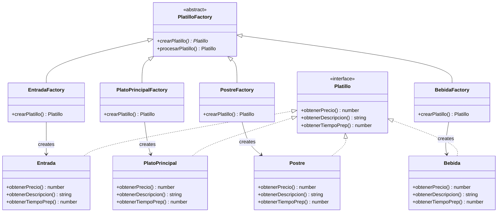

#### Diagrama de Secuencia - Factory Method

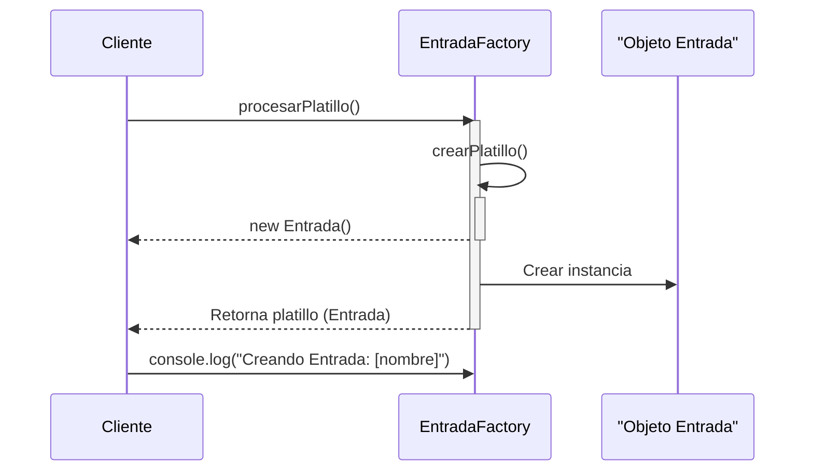

**Código Principal**:
```typescript
export abstract class PlatilloFactory {
    abstract crearPlatillo(): Platillo
    
    public procesarPlatillo(): Platillo {
        const platillo = this.crearPlatillo()
        console.log(`Creando ${platillo.categoria}: ${platillo.nombre}`)
        return platillo
    }
}

export class EntradaFactory extends PlatilloFactory {
    crearPlatillo(): Platillo {
        return new Entrada()
    }
}
```

**Ventajas**:
- Extensibilidad para nuevos tipos de platillos
- Separación de la lógica de creación
- Cumple con el principio Open/Closed

**Uso en el Sistema**:
- Creación de diferentes tipos de platillos según categoría
- Creación de pedidos según tipo (mesa, para llevar, domicilio)

---

### Abstract Factory

**Propósito**: Crear familias de objetos relacionados sin especificar sus clases concretas.

**Implementación**: Se implementó para crear componentes UI coherentes y diferentes tipos de reportes:

#### Diagrama de Clases - Abstract Factory

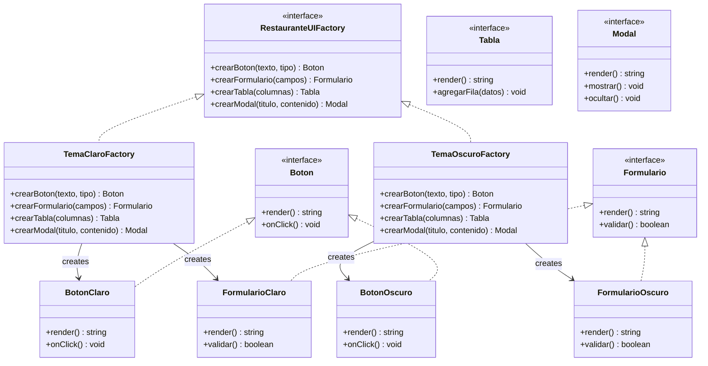

#### Diagrama de Secuencia - Abstract Factory

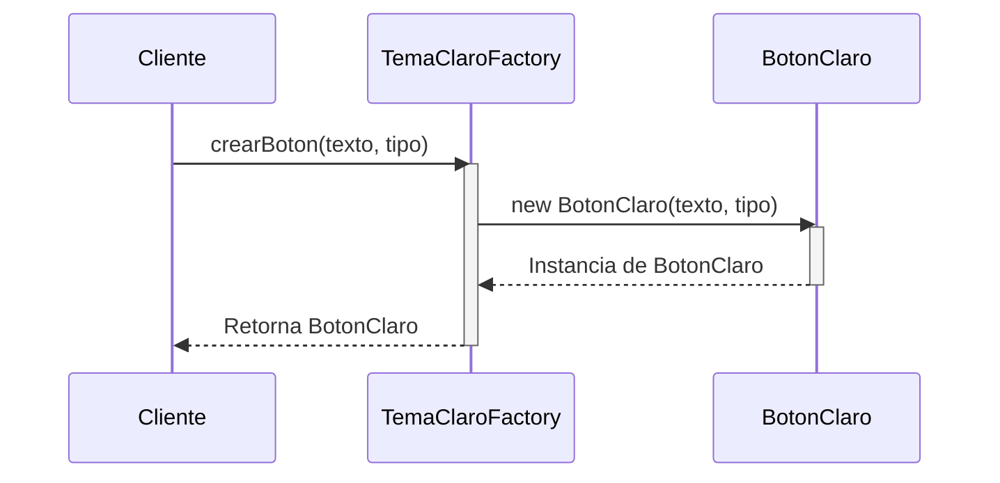

**Código Principal**:
```typescript
export interface RestauranteUIFactory {
    crearBoton(texto: string, tipo: 'primary' | 'secondary' | 'danger'): Boton
    crearFormulario(campos: string[]): Formulario
    crearTabla(columnas: string[]): Tabla
    crearModal(titulo: string, contenido: string): Modal
}

export class TemaClaroFactory implements RestauranteUIFactory {
    crearBoton(texto: string, tipo: 'primary' | 'secondary' | 'danger'): Boton {
        return new BotonClaro(texto, tipo)
    }
    // ... otros métodos
}
```

**Ventajas**:
- Consistencia visual en toda la aplicación
- Fácil cambio de tema (claro/oscuro)
- Extensibilidad para nuevos temas

**Uso en el Sistema**:
- Creación de componentes UI coherentes
- Generación de reportes en diferentes formatos (PDF, Excel, JSON)

---

### Prototype

**Propósito**: Crear objetos clonando una instancia existente en lugar de crear nuevos desde cero.

**Implementación**: Se implementó para clonar platillos, menús de temporada y clientes frecuentes:

#### Diagrama de Clases - Prototype

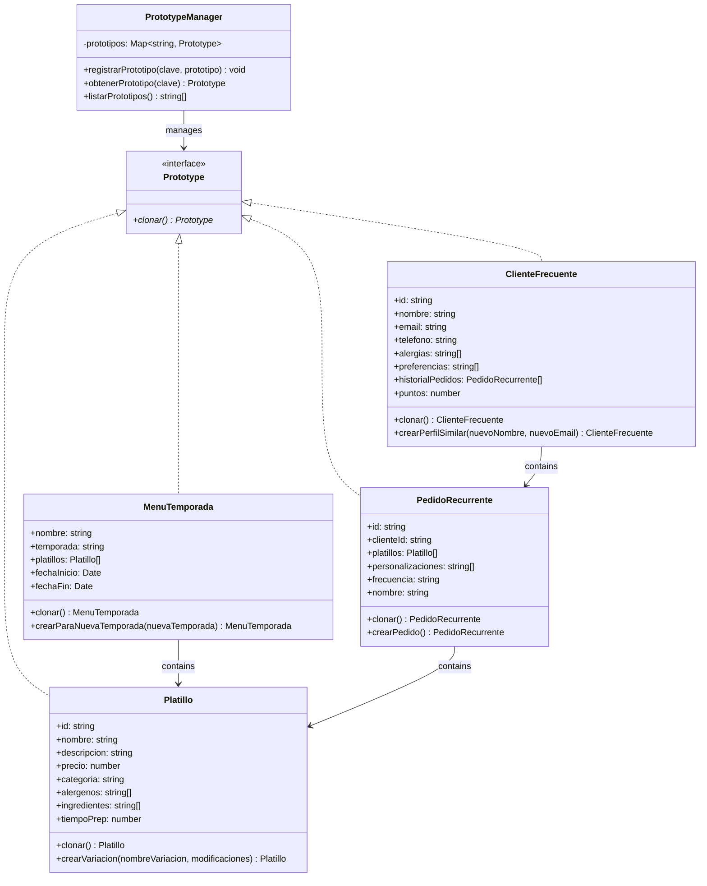

#### Diagrama de Secuencia - Prototype

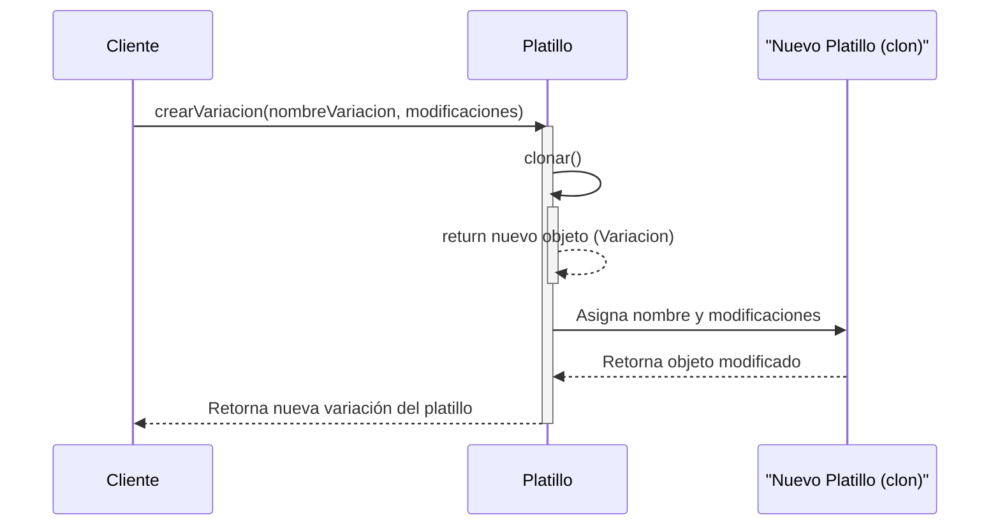

**Código Principal**:
```typescript
export class Platillo implements Prototype {
    clonar(): Platillo {
        return Object.assign(Object.create(Object.getPrototypeOf(this)), {
            ...this,
            id: Math.random().toString(36).substr(2, 9),
            alergenos: [...this.alergenos],
            ingredientes: [...this.ingredientes]
        })
    }
    
    crearVariacion(nombreVariacion: string, modificaciones: Partial<Platillo>): Platillo {
        const variacion = this.clonar()
        variacion.nombre = `${this.nombre} - ${nombreVariacion}`
        Object.assign(variacion, modificaciones)
        return variacion
    }
}
```

**Ventajas**:
- Eficiencia en la creación de objetos complejos
- Facilita la creación de variaciones
- Reduce la carga de inicialización

**Uso en el Sistema**:
- Clonación de platillos para crear variaciones
- Creación de menús para nuevas temporadas
- Duplicación de pedidos recurrentes

---

### Builder

**Propósito**: Construir objetos complejos paso a paso, permitiendo diferentes representaciones.

**Implementación**: Se implementó para construir pedidos complejos, reportes y notificaciones:

#### Diagrama de Clases - Builder

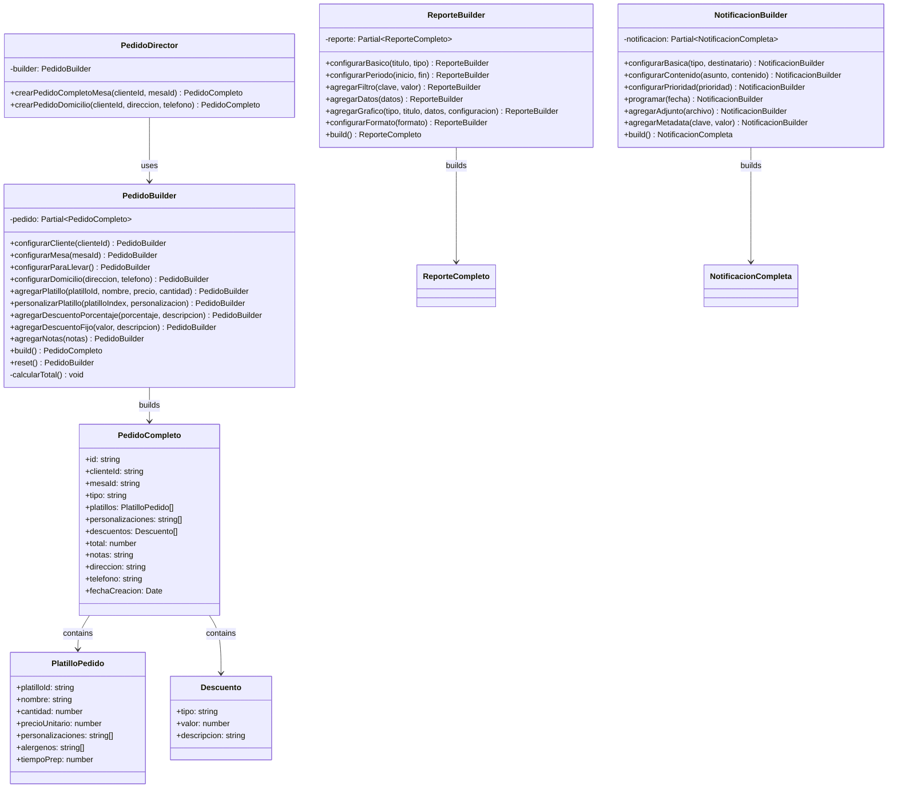

#### Diagrama de Secuencia - Builder

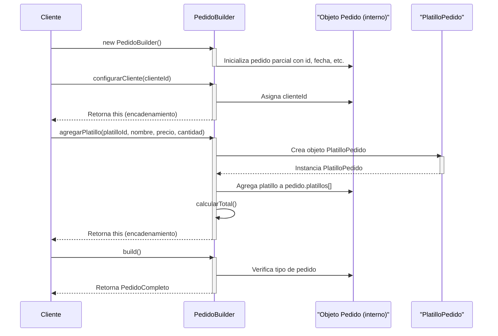

**Código Principal**:
```typescript
export class PedidoBuilder {
    private pedido: Partial<PedidoCompleto> = {
        id: Math.random().toString(36).substr(2, 9),
        platillos: [],
        personalizaciones: [],
        descuentos: [],
        total: 0,
        fechaCreacion: new Date()
    }
    
    public configurarCliente(clienteId: string): PedidoBuilder {
        this.pedido.clienteId = clienteId
        return this
    }
    
    public agregarPlatillo(platilloId: string, nombre: string, precio: number, cantidad: number = 1): PedidoBuilder {
        const platilloPedido: PlatilloPedido = {
            platilloId, nombre, cantidad, precioUnitario: precio,
            personalizaciones: [], alergenos: [], tiempoPrep: 15
        }
        this.pedido.platillos!.push(platilloPedido)
        this.calcularTotal()
        return this
    }
    
    public build(): PedidoCompleto {
        if (!this.pedido.tipo) {
            throw new Error('Debe especificar el tipo de pedido')
        }
        return this.pedido as PedidoCompleto
    }
}
```


**Ventajas**:
- Construcción paso a paso de objetos complejos
- Código más legible y mantenible
- Validación durante la construcción
- Reutilización del builder

**Uso en el Sistema**:
- Construcción de pedidos complejos con múltiples platillos
- Generación de reportes con varios filtros
- Creación de notificaciones con contenido variable

---

## Patrones Estructurales

### Decorator

**Propósito**: Añadir responsabilidades a objetos dinámicamente sin alterar su estructura.

**Implementación**: Se implementó para personalizar platillos, pedidos y clientes:

#### Diagrama de Clases - Decorator


#### Diagrama de Secuencia - Decorator

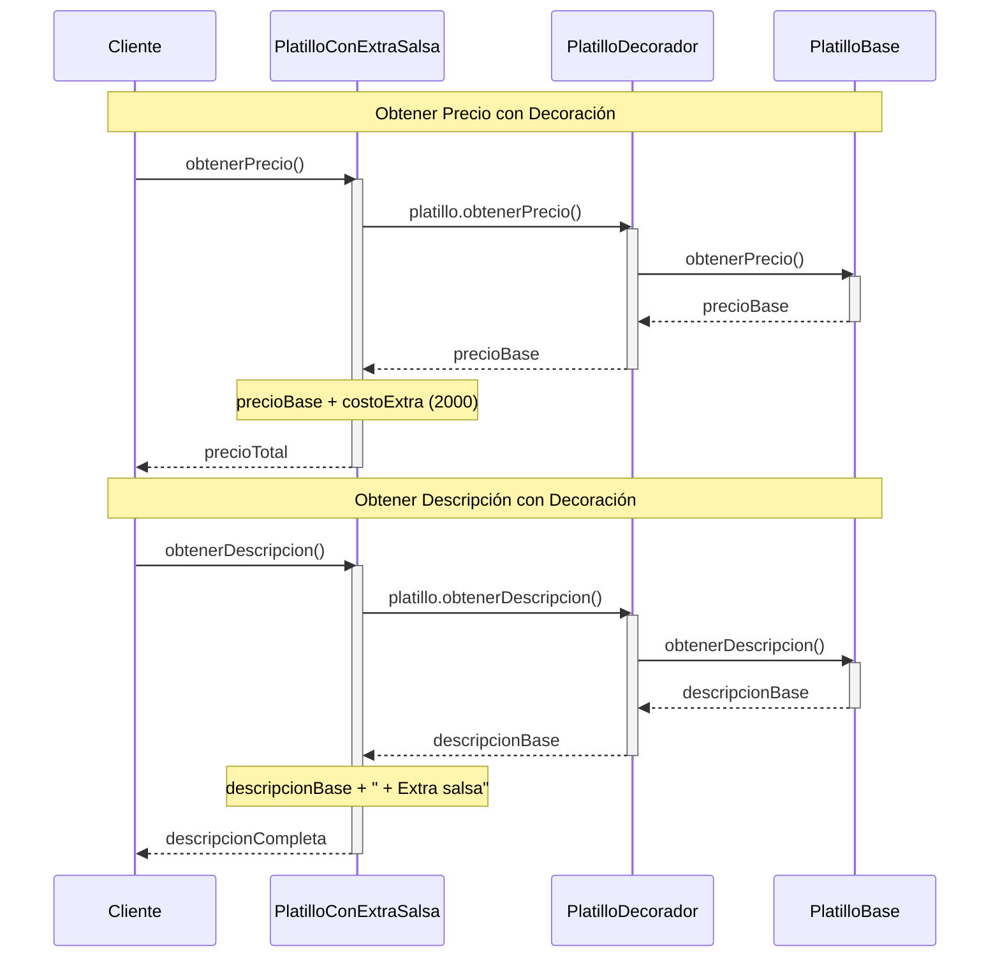


**Código Principal**:
```typescript
export abstract class PlatilloDecorador implements PlatilloBase {
    constructor(protected platillo: PlatilloBase) { }
    
    obtenerPrecio(): number {
        return this.platillo.obtenerPrecio()
    }
    // ... otros métodos base
}

export class PlatilloConExtraSalsa extends PlatilloDecorador {
    private costoExtra = 2000
    
    obtenerPrecio(): number {
        return this.platillo.obtenerPrecio() + this.costoExtra
    }
    
    obtenerDescripcion(): string {
        return this.platillo.obtenerDescripcion() + " + Extra salsa"
    }
}
```

¿Por qué se usó?

Necesidad: Agregar funcionalidades dinámicas a platillos sin modificar su estructura base
Problema que resuelve: Evitar crear una clase por cada combinación posible (Platillo + Salsa, Platillo + Queso, Platillo + Salsa + Queso, etc.)

-Añade extras de forma flexible y en tiempo de ejecución
-Cumple el principio Open/Closed (abierto para extensión, cerrado para modificación)
-Permite apilar múltiples decoradores (extra salsa + extra queso + extra carne)

Caso de uso real: Un restaurante donde los clientes personalizan sus platillos agregando ingredientes extras que tienen costo adicional.

**Ventajas**:
- Flexibilidad para añadir funcionalidades
- Composición dinámica de características
- Cumple con el principio Open/Closed

**Uso en el Sistema**:
- Personalización de platillos (extra salsa, sin gluten, etc.)
- Servicios adicionales en pedidos (envío, embalaje especial)
- Beneficios de clientes (VIP, Premium)

---

### Adapter

**Propósito**: Permitir que interfaces incompatibles trabajen juntas.

**Implementación**: Se implementó para integrar sistemas de pago externos y servicios de delivery:

#### Diagrama de Clases - Adapter

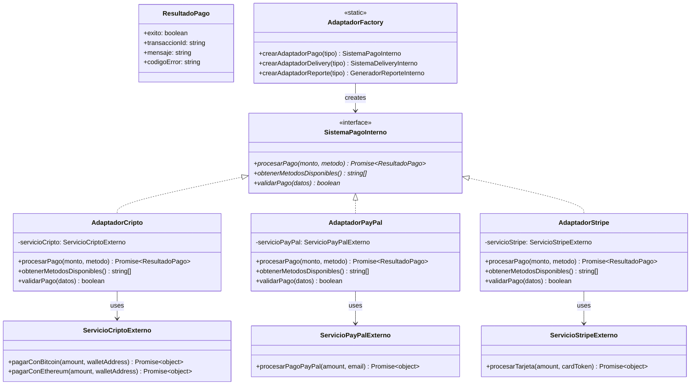

#### Diagrama de Secuencia - Adapter

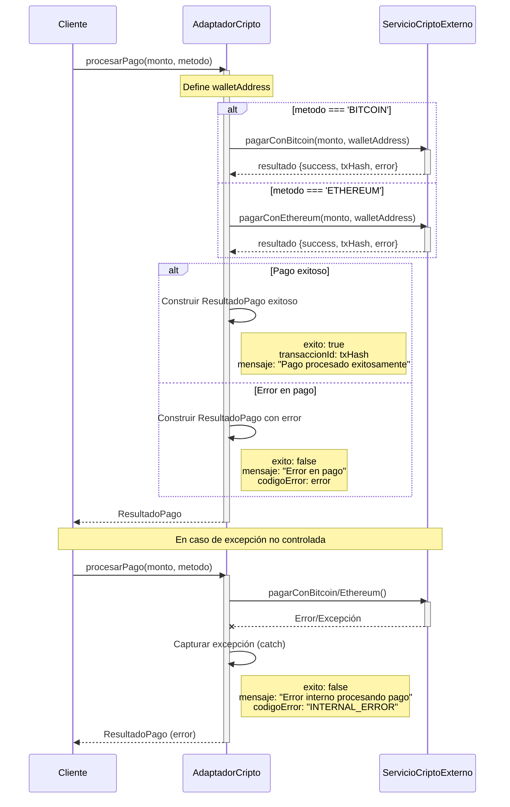

**Código Principal**:
```typescript
export class AdaptadorCripto implements SistemaPagoInterno {
    constructor(private servicioCripto: ServicioCriptoExterno) { }
    
    async procesarPago(monto: number, metodo: string): Promise<ResultadoPago> {
        try {
            const walletAddress = 'restaurant_wallet_address'
            
            let resultado
            if (metodo === 'BITCOIN') {
                resultado = await this.servicioCripto.pagarConBitcoin(monto, walletAddress)
            } else if (metodo === 'ETHEREUM') {
                resultado = await this.servicioCripto.pagarConEthereum(monto, walletAddress)
            }
            
            return {
                exito: resultado.success,
                transaccionId: resultado.txHash,
                mensaje: resultado.success ? 'Pago procesado exitosamente' : 'Error en pago',
                codigoError: resultado.error
            }
        } catch (error) {
            return {
                exito: false,
                mensaje: 'Error interno procesando pago',
                codigoError: 'INTERNAL_ERROR'
            }
        }
    }
}
```
¿Por qué se usó?
Necesidad: Integrar un servicio externo de criptomonedas que tiene una interfaz diferente a la que usa nuestro sistema de pagos interno.Problema que resuelve: El servicio externo usa métodos específicos (pagarConBitcoin, pagarConEthereum) que retornan objetos con estructura diferente ({success, txHash, error}), pero nuestro sistema espera un formato unificado ResultadoPago.Ventajas:

-  Convierte la interfaz externa incompatible en una compatible con nuestro sistema
- Permite cambiar o agregar nuevos servicios de pago sin modificar el código del sistema
- Encapsula la lógica de transformación de datos en un solo lugar
- Mantiene el código del sistema desacoplado de implementaciones externas

Caso de uso real: Un restaurante que integra múltiples pasarelas de pago (tarjetas, PayPal, criptomonedas) donde cada una tiene su propia API, pero el sistema necesita procesarlas de manera uniforme.

**Ventajas**:
- Integración de sistemas externos sin modificar código existente
- Reutilización de código legacy
- Separación de responsabilidades

**Uso en el Sistema**:
- Integración de pagos con criptomonedas, PayPal, Stripe
- Integración con servicios de delivery (Rappi, Uber Eats)
- Adaptación de generadores de reportes externos

---

### Bridge

**Propósito**: Desacoplar la abstracción de la implementación para que puedan variar independientemente.

**Implementación**: Se implementó para reportes, notificaciones y persistencia de datos:

#### Diagrama de Clases - Bridge

```mermaid
classDiagram
    class FormatoReporte {
        <<interface>>
        +exportar(datos)* string
        +obtenerExtension()* string
        +obtenerMimeType()* string
    }
    
    class ReportePDF {
        +exportar(datos) string
        +obtenerExtension() string
        +obtenerMimeType() string
    }
    
    class ReporteExcel {
        +exportar(datos) string
        +obtenerExtension() string
        +obtenerMimeType() string
    }
    
    class ReporteJSON {
        +exportar(datos) string
        +obtenerExtension() string
        +obtenerMimeType() string
    }
    
    class ReporteCSV {
        +exportar(datos) string
        +obtenerExtension() string
        +obtenerMimeType() string
    }
    
    class Reporte {
        <<abstract>>
        #formato: FormatoReporte
        +generar()* string
        +obtenerDatos()* any[]
        +exportar() string
        +obtenerNombreArchivo() string
        +obtenerMimeType() string
    }
    
    class ReporteVentas {
        -fechaInicio: Date
        -fechaFin: Date
        -datosVentas: any[]
        +generar() string
        +obtenerDatos() any[]
        -cargarDatosVentas() void
    }
    
    class ReporteInventario {
        -datosInventario: any[]
        +generar() string
        +obtenerDatos() any[]
        -cargarDatosInventario() void
    }
    
    class ReporteClientes {
        -datosClientes: any[]
        +generar() string
        +obtenerDatos() any[]
        -cargarDatosClientes() void
    }
    
    class CanalNotificacion {
        <<interface>>
        +enviar(mensaje, destinatario)* Promise~boolean~
        +obtenerTipo()* string
    }
    
    class CanalEmail {
        +enviar(mensaje, destinatario) Promise~boolean~
        +obtenerTipo() string
    }
    
    class CanalSMS {
        +enviar(mensaje, destinatario) Promise~boolean~
        +obtenerTipo() string
    }
    
    class CanalPush {
        +enviar(mensaje, destinatario) Promise~boolean~
        +obtenerTipo() string
    }
    
    class Notificacion {
        <<abstract>>
        #canal: CanalNotificacion
        +generarMensaje()* string
        +obtenerDestinatario()* string
        +enviar() Promise~boolean~
        +obtenerTipoCanal() string
    }
    
    class NotificacionStockBajo {
        -ingrediente: string
        -stockActual: number
        -stockMinimo: number
        +generarMensaje() string
        +obtenerDestinatario() string
    }
    
    class NotificacionPedidoListo {
        -numeroPedido: string
        -clienteTelefono: string
        +generarMensaje() string
        +obtenerDestinatario() string
    }
    
    FormatoReporte <|.. ReportePDF
    FormatoReporte <|.. ReporteExcel
    FormatoReporte <|.. ReporteJSON
    FormatoReporte <|.. ReporteCSV
    
    Reporte <|-- ReporteVentas
    Reporte <|-- ReporteInventario
    Reporte <|-- ReporteClientes
    
    Reporte --> FormatoReporte : uses
    
    CanalNotificacion <|.. CanalEmail
    CanalNotificacion <|.. CanalSMS
    CanalNotificacion <|.. CanalPush
    
    Notificacion <|-- NotificacionStockBajo
    Notificacion <|-- NotificacionPedidoListo
    
    Notificacion --> CanalNotificacion : uses
```

#### Diagrama de Secuencia - Bridge

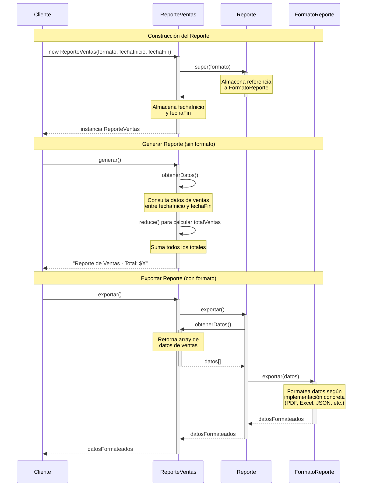


**Código Principal**:
```typescript
export abstract class Reporte {
    protected formato: FormatoReporte
    
    constructor(formato: FormatoReporte) {
        this.formato = formato
    }
    
    abstract generar(): string
    abstract obtenerDatos(): any[]
    
    public exportar(): string {
        const datos = this.obtenerDatos()
        return this.formato.exportar(datos)
    }
}

export class ReporteVentas extends Reporte {
    constructor(formato: FormatoReporte, fechaInicio: Date, fechaFin: Date) {
        super(formato)
        this.fechaInicio = fechaInicio
        this.fechaFin = fechaFin
    }
    
    generar(): string {
        const datos = this.obtenerDatos()
        const totalVentas = datos.reduce((sum, venta) => sum + venta.total, 0)
        return `Reporte de Ventas - Total: $${totalVentas}`
    }
}
```

¿Porque se uso?
Necesidad: Separar la abstracción tipo de reporte de su implementación en un formato de exportación para que ambas puedan variar independientemente.
Problema que resuelve: Evitar la explosión combinatoria de clases. Sin Bridge necesitarías: ReporteVentasPDF, ReporteVentasExcel, ReporteVentasJSON, ReporteInventarioPDF, ReporteInventarioExcel, ReporteInventarioJSON, etc.
Ventajas:

- Permite combinar cualquier tipo de reporte con cualquier formato sin crear nuevas clases
- Facilita agregar nuevos tipos de reportes sin modificar los formatos existentes
- Facilita agregar nuevos formatos sin modificar los reportes existentes
- Reduce el acoplamiento entre el contenido del reporte y su representación

Caso de uso real: Sistema de reportes empresariales donde se generan diferentes tipos de análisis (ventas, inventario, empleados, finanzas) y cada uno debe poder exportarse en múltiples formatos (PDF, Excel, JSON, CSV) según las necesidades del usuario.

**Ventajas**:
- Separación de abstracción e implementación
- Extensibilidad independiente
- Cumple con el principio de inversión de dependencias

**Uso en el Sistema**:
- Generación de reportes en múltiples formatos
- Envío de notificaciones por diferentes canales
- Persistencia de datos en diferentes bases de datos

---

### Proxy

**Propósito**: Controlar el acceso a objetos o aplazar costosas operaciones.

**Implementación**: Se implementó para inventario, pedidos y reportes con validación, caché y lazy loading:

#### Diagrama de Clases - Proxy


#### Diagrama de Secuencia - Proxy

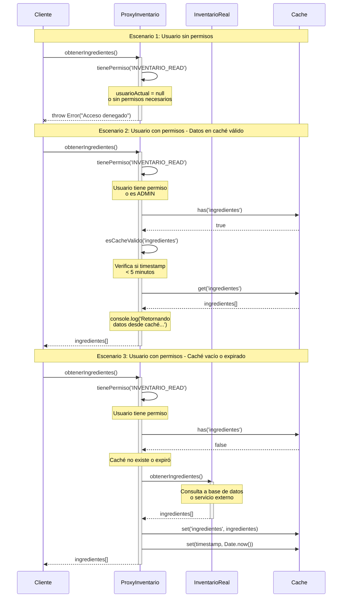

**Código Principal**:
```typescript
export class ProxyInventario implements Inventario {
    private inventarioReal: InventarioReal
    private usuarioActual: Usuario | null = null
    private cache: Map<string, Ingrediente[]> = new Map()
    private cacheTimestamp: Map<string, number> = new Map()
    private readonly CACHE_DURATION = 5 * 60 * 1000 // 5 minutos
    
    async obtenerIngredientes(): Promise<Ingrediente[]> {
        if (!this.tienePermiso('INVENTARIO_READ')) {
            throw new Error('Acceso denegado: No tiene permisos para leer el inventario')
        }
        
        // Verificar caché
        const cacheKey = 'ingredientes'
        if (this.cache.has(cacheKey) && this.esCacheValido(cacheKey)) {
            console.log('Retornando datos desde caché...')
            return this.cache.get(cacheKey)!
        }
        
        // Obtener datos reales y actualizar caché
        const ingredientes = await this.inventarioReal.obtenerIngredientes()
        this.cache.set(cacheKey, ingredientes)
        this.cacheTimestamp.set(cacheKey, Date.now())
        
        return ingredientes
    }
    
    private tienePermiso(permiso: string): boolean {
        if (!this.usuarioActual) return false
        return this.usuarioActual.permisos.includes(permiso) || this.usuarioActual.rol === 'ADMIN'
    }
}
```
¿Por qué se usó?
Necesidad: Controlar el acceso al inventario real agregando capas de seguridad, optimización y auditoría sin modificar la clase InventarioReal.
Problema que resuelve:

- Usuarios no autorizados podrían acceder a datos sensibles del inventario
- Consultas repetidas a la base de datos generan lentitud y sobrecarga
- Falta de trazabilidad sobre quién accede al inventario y cuándo

Seguridad: Valida permisos antes de permitir el acceso (control de acceso)
Performance: Implementa caché de 5 minutos para reducir consultas costosas a base de datos
Logging: Registra accesos para auditoría y debugging
Transparencia: El cliente usa la misma interfaz Inventario sin saber que existe un proxy intermediario

Caso de uso real: Sistema de restaurante donde solo gerentes y administradores pueden consultar el inventario, y las consultas frecuentes (durante preparación de los platillos) se cachean para no saturar la base de datos, manteniendo un registro de auditoría de quién consultó qué información.

**Ventajas**:
- Control de acceso y validación de permisos
- Caché para mejorar rendimiento
- Lazy loading de operaciones costosas
- Validación de transiciones de estado

**Uso en el Sistema**:
- Control de acceso al inventario con validación de permisos
- Caché de pedidos para mejorar rendimiento
- Generación de reportes bajo demanda con caché

---

## Patrones de Comportamiento

### Chain of Responsibility

**Propósito**: Pasar solicitudes de validación a lo largo de una cadena de manejadores. Al recibir una solicitud, cada manejador decide si la procesa o si la pasa al siguiente manejador de la cadena.

**Implementación**: Se implementó para validar pedidos mediante una cadena de validadores que procesan diferentes aspectos del pedido de forma secuencial.

#### Diagrama de Clases - Chain of Responsibility

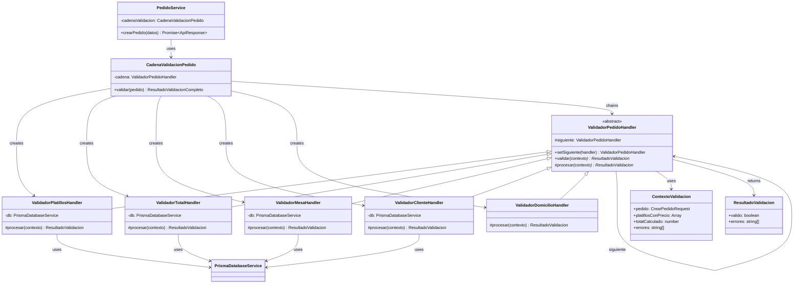

#### Diagrama de Secuencia - Chain of Responsibility

```mermaid
sequenceDiagram
    participant Cliente
    participant PedidoService
    participant CadenaValidacion
    participant ValidadorPlatillos
    participant ValidadorTotal
    participant ValidadorMesa
    participant ValidadorCliente
    participant ValidadorDomicilio
    
    Cliente->>PedidoService: crearPedido(datos)
    activate PedidoService
    
    PedidoService->>CadenaValidacion: validar(datos)
    activate CadenaValidacion
    
    CadenaValidacion->>CadenaValidacion: Crear contexto con pedido
    Note over CadenaValidacion: contexto: {pedido, errores: []}
    
    CadenaValidacion->>ValidadorPlatillos: validar(contexto)
    activate ValidadorPlatillos
    
    ValidadorPlatillos->>ValidadorPlatillos: procesar(contexto)
    Note over ValidadorPlatillos: Valida platillos existentes,<br/>activos, cantidades
    
    alt Validación exitosa
        ValidadorPlatillos-->>ValidadorPlatillos: {valido: true, errores: []}
        
        ValidadorPlatillos->>ValidadorTotal: validar(contexto)
        activate ValidadorTotal
        
        ValidadorTotal->>ValidadorTotal: procesar(contexto)
        Note over ValidadorTotal: Calcula totales,<br/>prepara platillosConPrecio
        
        ValidadorTotal->>ValidadorTotal: contexto.totalCalculado = X
        ValidadorTotal->>ValidadorTotal: contexto.platillosConPrecio = [...]
        
        ValidadorTotal-->>ValidadorTotal: {valido: true, errores: []}
        
        ValidadorTotal->>ValidadorMesa: validar(contexto)
        activate ValidadorMesa
        
        ValidadorMesa->>ValidadorMesa: procesar(contexto)
        Note over ValidadorMesa: Valida si es pedido de mesa<br/>y mesa disponible
        
        ValidadorMesa-->>ValidadorMesa: {valido: true, errores: []}
        
        ValidadorMesa->>ValidadorCliente: validar(contexto)
        activate ValidadorCliente
        
        ValidadorCliente->>ValidadorCliente: procesar(contexto)
        Note over ValidadorCliente: Valida cliente si existe
        
        ValidadorCliente-->>ValidadorCliente: {valido: true, errores: []}
        
        ValidadorCliente->>ValidadorDomicilio: validar(contexto)
        activate ValidadorDomicilio
        
        ValidadorDomicilio->>ValidadorDomicilio: procesar(contexto)
        Note over ValidadorDomicilio: Valida dirección y teléfono<br/>si es pedido a domicilio
        
        ValidadorDomicilio-->>ValidadorDomicilio: {valido: true, errores: []}
        
        deactivate ValidadorDomicilio
        deactivate ValidadorCliente
        deactivate ValidadorMesa
        deactivate ValidadorTotal
        deactivate ValidadorPlatillos
        
        CadenaValidacion-->>CadenaValidacion: {valido: true, contexto}
        CadenaValidacion-->>PedidoService: {valido: true, contexto}
        deactivate CadenaValidacion
        
        PedidoService->>PedidoService: Crear pedido con datos validados
        PedidoService-->>Cliente: {success: true, data: pedido}
        
    else Error en validación
        ValidadorPlatillos-->>ValidadorPlatillos: {valido: false, errores: [...]}
        ValidadorPlatillos-->>CadenaValidacion: {valido: false, errores: [...]}
        deactivate ValidadorPlatillos
        
        CadenaValidacion-->>PedidoService: {valido: false, errores: [...]}
        deactivate CadenaValidacion
        
        PedidoService-->>Cliente: {success: false, error: "errores..."}
    end
    
    deactivate PedidoService
```

#### Código Principal

```typescript
export abstract class ValidadorPedidoHandler {
    protected siguiente?: ValidadorPedidoHandler;

    public setSiguiente(handler: ValidadorPedidoHandler): ValidadorPedidoHandler {
        this.siguiente = handler;
        return handler;
    }

    public async validar(contexto: ContextoValidacion): Promise<ResultadoValidacion> {
        const resultado = await this.procesar(contexto);
        
        if (!resultado.valido) {
            return resultado;
        }

        if (this.siguiente) {
            return await this.siguiente.validar(contexto);
        }

        return {
            valido: contexto.errores.length === 0,
            errores: contexto.errores
        };
    }

    protected abstract procesar(contexto: ContextoValidacion): Promise<ResultadoValidacion>;
}

export class ValidadorPlatillosHandler extends ValidadorPedidoHandler {
    private db: PrismaDatabaseService;

    constructor() {
        super();
        this.db = PrismaDatabaseService.getInstance();
    }

    protected async procesar(contexto: ContextoValidacion): Promise<ResultadoValidacion> {
        const { pedido } = contexto;

        if (!pedido.platillos || pedido.platillos.length === 0) {
            contexto.errores.push('El pedido debe tener al menos un platillo');
            return { valido: false, errores: contexto.errores };
        }

        const menu = await this.db.obtenerPlatillos();

        for (let i = 0; i < pedido.platillos.length; i++) {
            const platilloRequest = pedido.platillos[i];
            const platillo = menu.find((p: any) => p.id === platilloRequest.platilloId);

            if (!platillo) {
                contexto.errores.push(`El platillo con ID ${platilloRequest.platilloId} no existe`);
                continue;
            }

            if (!platillo.activo) {
                contexto.errores.push(`El platillo "${platillo.nombre}" no está disponible`);
                continue;
            }

            if (platilloRequest.cantidad <= 0) {
                contexto.errores.push(`La cantidad del platillo "${platillo.nombre}" debe ser mayor a 0`);
                continue;
            }

            if (platilloRequest.cantidad > 100) {
                contexto.errores.push(`La cantidad del platillo "${platillo.nombre}" no puede ser mayor a 100`);
                continue;
            }
        }

        if (contexto.errores.length > 0) {
            return { valido: false, errores: contexto.errores };
        }

        return { valido: true, errores: [] };
    }
}

export class CadenaValidacionPedido {
    private cadena: ValidadorPedidoHandler;

    constructor() {
        const validadorPlatillos = new ValidadorPlatillosHandler();
        const validadorTotal = new ValidadorTotalHandler();
        const validadorMesa = new ValidadorMesaHandler();
        const validadorCliente = new ValidadorClienteHandler();
        const validadorDomicilio = new ValidadorDomicilioHandler();

        this.cadena = validadorPlatillos;
        validadorPlatillos.setSiguiente(validadorTotal);
        validadorTotal.setSiguiente(validadorMesa);
        validadorMesa.setSiguiente(validadorCliente);
        validadorCliente.setSiguiente(validadorDomicilio);
    }

    public async validar(pedido: CrearPedidoRequest): Promise<ResultadoValidacionCompleto> {
        const contexto: ContextoValidacion = {
            pedido,
            errores: []
        };

        const resultado = await this.cadena.validar(contexto);

        return {
            ...resultado,
            contexto
        };
    }
}
```

#### Ejemplo de Uso

```typescript
// En PedidoService
export class PedidoService {
    private cadenaValidacion: CadenaValidacionPedido;

    constructor() {
        this.cadenaValidacion = new CadenaValidacionPedido();
    }

    async crearPedido(datos: CrearPedidoRequest): Promise<ApiResponse<Pedido>> {
        const resultadoValidacion = await this.cadenaValidacion.validar(datos);

        if (!resultadoValidacion.valido) {
            return {
                success: false,
                error: resultadoValidacion.errores.join('; ')
            };
        }

        const contexto = resultadoValidacion.contexto;
        
        const pedidoData = {
            clienteId: datos.clienteId,
            mesaId: datos.mesaId,
            tipo: datos.tipo,
            estado: EstadoPedido.RECIBIDO,
            total: contexto.totalCalculado || 0,
            notas: datos.notas || '',
            direccion: datos.direccion,
            telefono: datos.telefono,
            platillos: contexto.platillosConPrecio || []
        };

        const pedidoGuardado = await this.db.crearPedido(pedidoData);

        return {
            success: true,
            data: pedidoGuardado as any,
            message: 'Pedido creado exitosamente'
        };
    }
}
```

#### Manejadores Implementados

1. **ValidadorPlatillosHandler**: Valida que el pedido tenga platillos, que existan, estén activos y las cantidades sean válidas.
2. **ValidadorTotalHandler**: Calcula el total del pedido y prepara los platillos con precios.
3. **ValidadorMesaHandler**: Valida que la mesa esté disponible si es un pedido de mesa.
4. **ValidadorClienteHandler**: Valida que el cliente exista y esté activo si se proporciona.
5. **ValidadorDomicilioHandler**: Valida dirección y teléfono para pedidos a domicilio.

#### ¿Por qué se usó?

**Necesidad**: Implementar un sistema de validación flexible y extensible para pedidos que permita agregar nuevas reglas sin modificar código existente.

**Problema que resuelve**:
- Evita métodos de validación monolíticos con múltiples condicionales anidados
- Permite reutilizar validadores en diferentes contextos
- Facilita agregar o modificar reglas de validación sin afectar otras
- Separa la responsabilidad de cada validación en clases independientes

**Ventajas**:
- **Extensibilidad**: Fácil agregar nuevos validadores sin modificar código existente
- **Mantenibilidad**: Cada validador tiene una responsabilidad única y clara
- **Flexibilidad**: Se puede reordenar o remover validadores de la cadena fácilmente
- **Reutilización**: Los validadores pueden usarse en diferentes contextos
- **Separación de responsabilidades**: Cada validador se enfoca en un aspecto específico

**Caso de uso real**: Sistema de restaurante donde un pedido debe pasar por múltiples validaciones (platillos disponibles, mesa libre, cliente válido, datos de domicilio, etc.) antes de ser creado. Cada validación puede detener el proceso si encuentra un error, o continuar con la siguiente validación si todo está correcto.

**Uso en el Sistema**:
- Validación completa de pedidos antes de crearlos
- Validación de datos de domicilio para entregas
- Validación de disponibilidad de mesas
- Validación de existencia y estado de clientes

---

## Diagrama de Despliegue

### Despliegue en Railway

El sistema está configurado para desplegarse en **Railway**, una plataforma de despliegue en la nube que ofrece integración con GitHub y despliegue automático.

#### Arquitectura de Despliegue

El diagrama de despliegue completo está disponible en [Diagramas.md](./Diagramas.md#diagrama-de-despliegue---railway) e incluye:

- **Servicios**: Next.js Application, PostgreSQL Database, Servicios adicionales
- **Red Privada**: Comunicación segura entre servicios
- **Recursos**: Persistent Volumes, Logs & Monitoring
- **Integraciones**: GitHub CI/CD, Factus API, DIAN

#### Componentes Principales

1. **Next.js Application (ObraBlanca-POS)**
   - Tecnología: Node.js 20.x, Next.js 16.0
   - Build: `npm run build`
   - Start: `npm start`
   - Variables de entorno configuradas en Railway

2. **PostgreSQL Database**
   - Versión: PostgreSQL 15
   - Base de datos: `restaurant_db`
   - Backups automáticos
   - Acceso mediante Prisma ORM

3. **CI/CD Pipeline**
   - Integración con GitHub
   - Despliegue automático en push
   - Build y validación automáticos

#### Configuración Requerida

Para desplegar el sistema en Railway, se requiere:

```bash
# 1. Instalar Railway CLI
npm i -g @railway/cli

# 2. Autenticarse
railway login

# 3. Vincular proyecto (opcional)
railway link

# 4. Configurar variables de entorno
railway variables set DATABASE_URL=...
railway variables set FACTUS_CLIENT_ID=...
railway variables set FACTUS_CLIENT_SECRET=...
```

#### Variables de Entorno

Las siguientes variables deben configurarse en Railway:

- `DATABASE_URL`: Conexión a PostgreSQL
- `NEXTAUTH_SECRET`: Secret para autenticación
- `FACTUS_CLIENT_ID`: Client ID de Factus API
- `FACTUS_CLIENT_SECRET`: Client Secret de Factus API
- `FACTUS_API_URL`: URL de la API de Factus
- `NODE_ENV`: production

Para más detalles sobre el diagrama de despliegue, consulte [Diagramas.md](./Diagramas.md#diagrama-de-despliegue---railway).

---

## Facturación Electrónica

### Integración con Factus API

El sistema implementa una integración completa con **Factus API**, el proveedor oficial de facturación electrónica en Colombia, cumpliendo con todas las normativas DIAN.

#### Características Implementadas

- **Autenticación OAuth2** con renovación automática de tokens
- **Generación de facturas electrónicas** con CUFE automático
- **Validación previa** de datos antes del envío
- **Descarga de PDFs** de facturas generadas
- **Manejo de rangos de numeración** automático
- **Soporte para múltiples tipos de documento** (factura, nota crédito, nota débito)
- **Integración con métodos de pago** (efectivo, tarjeta, transferencia, cheque)

#### Servicios Implementados

```typescript
// Servicio de autenticación con Factus
export class FactusAuthService {
    private static instance: FactusAuthService
    private accessToken: string | null = null
    private tokenExpiry: Date | null = null
    
    public static getInstance(): FactusAuthService {
        if (!FactusAuthService.instance) {
            FactusAuthService.instance = new FactusAuthService()
        }
        return FactusAuthService.instance
    }
    
    async getValidAccessToken(): Promise<string> {
        if (!this.accessToken || !this.tokenExpiry || new Date() >= this.tokenExpiry) {
            await this.refreshAccessToken()
        }
        return this.accessToken!
    }
}
```

```typescript
// Servicio principal de facturación
export class FactusInvoiceService {
    async createInvoice(invoiceRequest: FactusInvoiceRequest): Promise<FactusInvoiceResponse> {
        const accessToken = await this.authService.getValidAccessToken()
        
        const response = await fetch(`${this.apiUrl}/v1/bills/validate`, {
            method: 'POST',
            headers: {
                'Accept': 'application/json',
                'Content-Type': 'application/json',
                'Authorization': `Bearer ${accessToken}`
            },
            body: JSON.stringify(invoiceRequest)
        })
        
        return await response.json()
    }
}
```

### Patrones Aplicados

#### 1. Builder Pattern - FactusInvoiceBuilder

**Propósito**: Construir facturas electrónicas complejas paso a paso con validación.

```typescript
export class FactusInvoiceBuilder {
    private invoiceRequest: Partial<FactusInvoiceRequest> = {}
    
    public setReferenceCode(referenceCode: string): FactusInvoiceBuilder {
        this.invoiceRequest.reference_code = referenceCode
        return this
    }
    
    public setCustomer(customer: FactusCustomer): FactusInvoiceBuilder {
        this.invoiceRequest.customer = customer
        return this
    }
    
    public addItem(item: FactusItem): FactusInvoiceBuilder {
        if (!this.invoiceRequest.items) {
            this.invoiceRequest.items = []
        }
        this.invoiceRequest.items.push(item)
        return this
    }
    
    public build(): FactusInvoiceRequest {
        if (!this.invoiceRequest.reference_code) {
            throw new Error('El código de referencia es obligatorio')
        }
        if (!this.invoiceRequest.customer) {
            throw new Error('Los datos del cliente son obligatorios')
        }
        if (!this.invoiceRequest.items || this.invoiceRequest.items.length === 0) {
            throw new Error('Debe incluir al menos un item')
        }
        
        return this.invoiceRequest as FactusInvoiceRequest
    }
}
```

**Ejemplo de Uso**:
```typescript
const factura = new FactusInvoiceBuilder()
    .setReferenceCode('REF20241201123456')
    .setCustomer(clienteFactus)
    .addItem(item1)
    .addItem(item2)
    .setPaymentMethod('10') // Efectivo
    .setPaymentForm('1') // Contado
    .build()
```

#### 2. Factory Method Pattern - FactusInvoiceServiceFactory

**Propósito**: Crear servicios de facturación para diferentes entornos.

```typescript
export class FactusInvoiceServiceFactory {
    public static createForTesting(): FactusInvoiceService {
        const authService = FactusAuthService.getInstance()
        return new FactusInvoiceService(authService, 'https://api-sandbox.factus.com.co')
    }
    
    public static createForProduction(): FactusInvoiceService {
        const authService = FactusAuthService.getInstance()
        return new FactusInvoiceService(authService, 'https://api.factus.com.co')
    }
    
    public static createWithConfig(authService: FactusAuthService, apiUrl: string): FactusInvoiceService {
        return new FactusInvoiceService(authService, apiUrl)
    }
}
```

#### 3. Adapter Pattern - FactusAdapterService

**Propósito**: Adaptar datos del sistema del restaurante al formato requerido por Factus API.

```typescript
export class FactusAdapterService {
    public static adaptarCliente(cliente: RestauranteCliente): FactusCustomer {
        const tipoDocumentoMap: Record<string, number> = {
            'cedula': FactusIdentificationDocument.CEDULA_CIUDADANIA,
            'nit': FactusIdentificationDocument.NIT,
            'cedula_extranjeria': FactusIdentificationDocument.CEDULA_EXTRANJERIA,
            'pasaporte': FactusIdentificationDocument.PASAPORTE
        }
        
        return {
            identification_document_id: tipoDocumentoMap[cliente.tipoDocumento],
            identification: cliente.numeroDocumento,
            dv: cliente.digitoVerificacion,
            company: cliente.esPersonaJuridica ? cliente.razonSocial : undefined,
            names: cliente.esPersonaJuridica ? undefined : `${cliente.nombre} ${cliente.apellido || ''}`.trim(),
            address: cliente.direccion,
            email: cliente.email,
            phone: cliente.telefono,
            legal_organization_id: cliente.esPersonaJuridica
                ? FactusLegalOrganizationType.PERSONA_JURIDICA
                : FactusLegalOrganizationType.PERSONA_NATURAL,
            tribute_id: FactusTributeType.NO_APLICA,
            municipality_id: cliente.municipioId
        }
    }
    
    public static adaptarPlatillo(platillo: RestaurantePlatillo): FactusItem {
        return {
            code_reference: platillo.codigo,
            name: platillo.nombre,
            quantity: platillo.cantidad,
            discount_rate: platillo.descuentoPorcentaje || 0,
            price: platillo.precio,
            tax_rate: platillo.impuestoPorcentaje.toString(),
            unit_measure_id: 70, // UNIDAD
            standard_code_id: 1, // ESTANDAR_CONTRIBUYENTE
            is_excluded: platillo.estaExcluidoIVA ? 1 : 0,
            tribute_id: 1 // IVA
        }
    }
}
```

#### 4. Singleton Pattern - FactusAuthService

**Propósito**: Gestionar la autenticación única con Factus API.

```typescript
export class FactusAuthService {
    private static instance: FactusAuthService
    private accessToken: string | null = null
    private tokenExpiry: Date | null = null
    
    private constructor() {
        console.log('🔐 FactusAuthService: Instancia creada')
    }
    
    public static getInstance(): FactusAuthService {
        if (!FactusAuthService.instance) {
            FactusAuthService.instance = new FactusAuthService()
        }
        return FactusAuthService.instance
    }
    
    async getValidAccessToken(): Promise<string> {
        if (!this.accessToken || !this.tokenExpiry || new Date() >= this.tokenExpiry) {
            await this.refreshAccessToken()
        }
        return this.accessToken!
    }
}
```

### Flujo de Facturación Electrónica

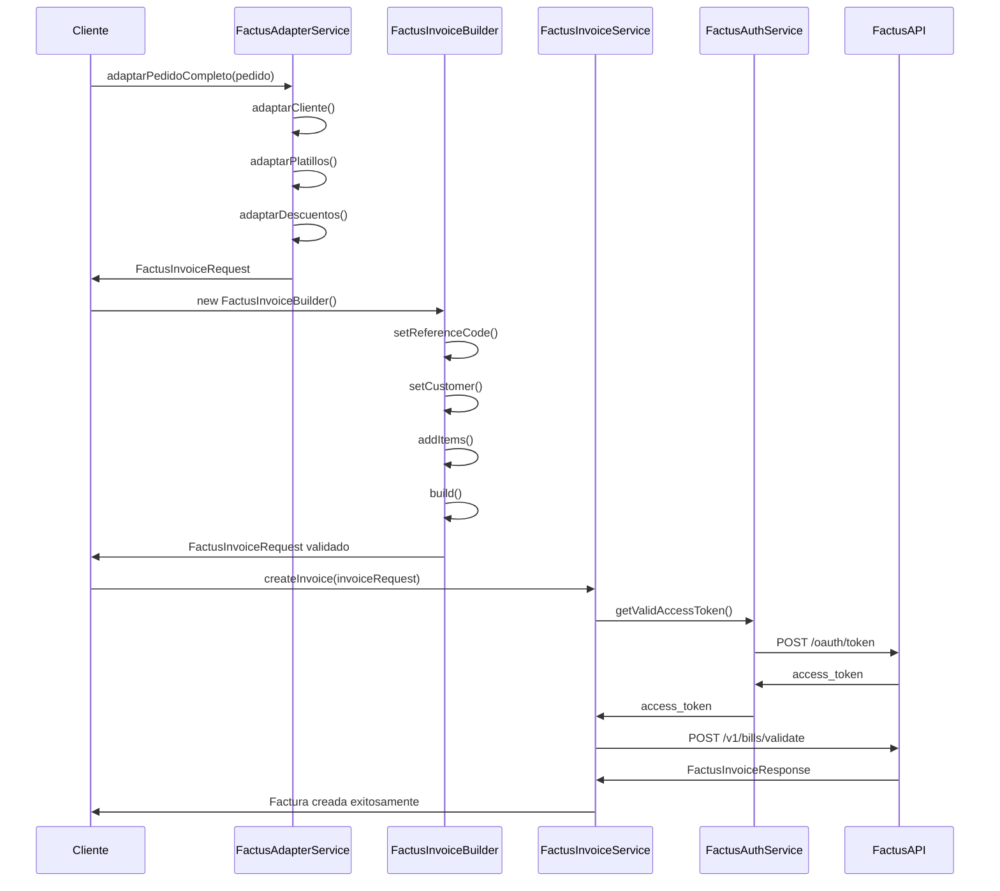

### Validaciones Implementadas

El sistema incluye validaciones exhaustivas antes del envío a Factus:

```typescript
public static validarPedido(pedido: RestaurantePedido): { isValid: boolean; errors: string[] } {
    const errors: string[] = []
    
    // Validar cliente
    const clienteValidation = this.validarCliente(pedido.cliente)
    if (!clienteValidation.isValid) {
        errors.push(...clienteValidation.errors.map(error => `Cliente: ${error}`))
    }
    
    // Validar platillos
    if (!pedido.platillos || pedido.platillos.length === 0) {
        errors.push('El pedido debe tener al menos un platillo')
    } else {
        pedido.platillos.forEach((platillo, index) => {
            const platilloValidation = this.validarPlatillo(platillo)
            if (!platilloValidation.isValid) {
                errors.push(...platilloValidation.errors.map(error => `Platillo ${index + 1}: ${error}`))
            }
        })
    }
    
    // Validar forma de pago
    if (pedido.formaPago === 'credito' && !pedido.fechaVencimiento) {
        errors.push('La fecha de vencimiento es obligatoria para pagos a crédito')
    }
    
    return {
        isValid: errors.length === 0,
        errors
    }
}
```

---
